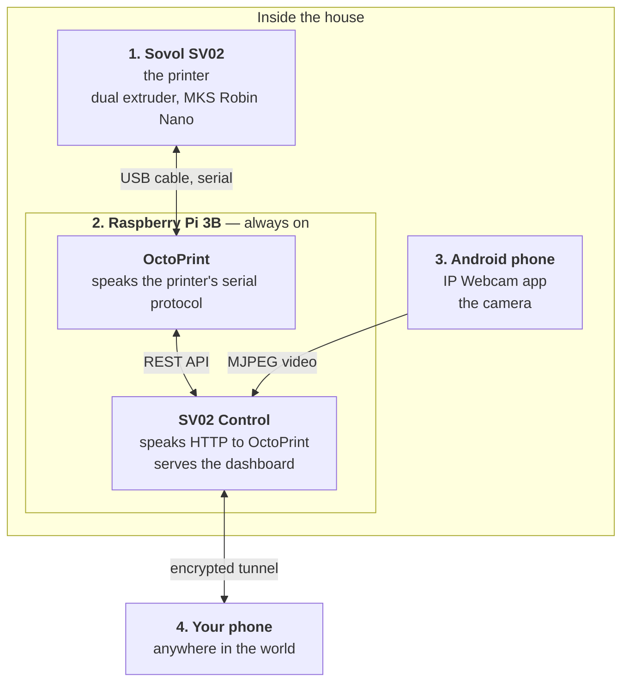
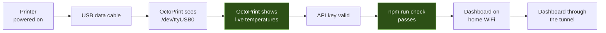
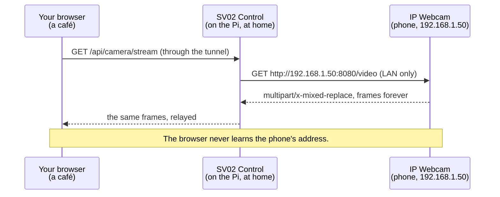

# 01 — Project overview

**What this document is for:** to explain, before any command is typed, what
we are building, why each piece exists, and what the words mean. If you read
only one document, read this one — everything else assumes it.

## Contents

- [The problem](#the-problem)
- [What we are building](#what-we-are-building)
- [The four moving parts](#the-four-moving-parts)
- [The single most important structural fact](#the-single-most-important-structural-fact)
- [Why the camera has to be relayed](#why-the-camera-has-to-be-relayed)
- [What the finished thing does](#what-the-finished-thing-does)
- [What it deliberately does not do](#what-it-deliberately-does-not-do)
- [Hardware and software inventory](#hardware-and-software-inventory)
- [Glossary](#glossary)

---

## The problem

A Sovol SV02 out of the box is a machine you have to stand next to. To start a
print you walk an SD card over to it. To know whether it is still printing you
walk back. If a hotend fails at hour six of an eight-hour print, you find out
at hour eight, and the only evidence is a bird's nest of plastic.

Three things are missing, and they are all *information* problems rather than
mechanical ones:

1. **You cannot see it.** No camera, no view, no idea what the first layer did.
2. **You cannot reach it.** No network. Files move by SD card, controls are on
   a 3-inch screen you have to be standing at.
3. **It cannot tell you anything.** No alerts. A failure is silent until you
   physically look.

## What we are building

A single web page — mobile-first, password-protected, reachable from anywhere
— that answers "what is my printer doing right now?" in one glance, and lets
you do something about it.

The page shows the camera as the centrepiece, both nozzle temperatures and the
bed, the progress bar with time remaining, and the controls: pause, resume,
cancel, emergency stop, upload-and-print, reprint, home, auto-level, cool down.
Behind it, a watchdog checks every 2.5 seconds whether any temperature has
drifted dangerously from its target, and if it has, your phone buzzes.

## The four moving parts

**1. The printer.** A Sovol SV02: dual extruder, MKS Robin Nano 32-bit board,
Marlin 2.0 firmware from Sovol, manual bed levelling as standard. It speaks a
serial protocol over its USB port at 115200 baud. It has no networking of its
own and never will.

**2. The Raspberry Pi.** A computer that stays powered on next to the printer,
connected by USB. It runs *two* programs:

- **OctoPrint** — mature, well-known software whose entire job is to speak the
  printer's serial protocol and expose it as a web interface and a REST API.
- **SV02 Control** — the app in this repository. It never touches the serial
  port. It asks OctoPrint questions over HTTP and renders the answers.

**3. The camera.** An old Android phone running the *IP Webcam* app, propped
where it can see the bed, on a charger. It serves an MJPEG video stream on the
local network. This is far cheaper and far better than a USB webcam, and the
phone you already own is the best camera in the house.

**4. Your phone.** A browser. Nothing to install.

## The single most important structural fact

> **This app never talks to the printer. It talks to OctoPrint, and OctoPrint
> talks to the printer.**

Every setup problem, every debugging session, and every design decision in
this project follows from that one sentence. It has two consequences worth
internalising:

- **OctoPrint has to work first.** If OctoPrint cannot show live temperatures,
  nothing downstream can. This is why the runbook makes that a hard gate.
- **When something breaks, work backwards along the chain** and fix the
  earliest broken link. Fixing a later one first never works.

The two green boxes are the gates. Everything to the right of a gate is
untestable until the gate passes.

## Why the camera has to be relayed

This is the least obvious design decision in the project, so it is worth
stating plainly.

Your camera phone has an address like `192.168.1.50`. That address is
meaningful **only inside your house**. When you open the dashboard from a café,
your browser cannot fetch `http://192.168.1.50:8080/video` — there is no route
to it, and there never will be.

So the browser never tries. Instead, the **Pi** fetches the video (it *is*
inside the house, on the same LAN as the phone) and pipes it back down the same
connection the dashboard is already using.

Two things fall out of this for free: the phone's address and any camera
password stay on the server, and the video works from anywhere the dashboard
works, with no extra configuration.

## What the finished thing does

| Capability | Detail |
|---|---|
| **Live camera** | MJPEG relayed from the phone, with automatic reconnection (2s, 4s, 8s, 16s, then every 20s) and a still-frame fallback if the stream will not hold. |
| **Live temperatures** | One card per heater the printer actually has. The SV02's two extruder drives share **one** nozzle, so that is a nozzle card and a bed card. Whether a nozzle is shared comes from the OctoPrint printer profile — nothing is hardcoded, and a machine with independent hotends gets a card each. |
| **Layer view** | A 2D view of the layer being printed beside a 3D view of the stack so far, with the nozzle marked — drawn from the sliced file and OctoPrint's byte position in it. Works when the camera does not. |
| **Progress** | Filename, percentage, elapsed, remaining. |
| **Controls** | Pause, resume, cancel (confirmed), emergency stop (`M112`, confirmed). |
| **Upload and print** | Drop a `.gcode` file, it uploads to OctoPrint and starts. 250 MB cap. |
| **Reprint** | Everything already stored on the printer, newest first, with a Print button. No re-upload. |
| **Maintenance** | Home (`G28`), auto bed level (`G28`+`G29`), save to EEPROM (`M500`), release motors (`M18`), cool down (`M104 S0`/`M140 S0`). Anything unsafe mid-print is refused by the server. |
| **Failure detection** | A temperature more than 15 °C from target for more than 30 seconds mid-print raises an alert: phone notification, in-app banner, log line. Optionally auto-pauses. |
| **Notifications** | Print started, complete, failed, printer unreachable, temperature anomaly — via [ntfy.sh](https://ntfy.sh), free, no account. |
| **Security** | One password. Session cookie signed with HMAC. Login throttled to 8 attempts per 15 minutes per IP. G-code is a fixed allowlist, not a pass-through. |

## What it deliberately does not do

Being explicit about the boundaries is more useful than a feature list.

- **It is not a fire safety device.** It watches temperatures reported by the
  printer's own firmware. It cannot detect a thermal runaway that the firmware
  itself misses, and it can do nothing at all if the WiFi is down. Put a smoke
  alarm in the room. This is not a formality.
- **It does not accept arbitrary G-code from the browser.** The maintenance
  buttons map to five fixed commands. Since this app is reachable from the
  internet behind one password, a G-code pass-through would be a far larger
  blast radius than five known-safe commands.
- **It does not replace OctoPrint.** OctoPrint's own interface is still there
  on port 5000, with the terminal, the plugin ecosystem, and the settings.
  This app is the phone-shaped 10% you use every day.
- **It does not do per-user accounts.** One shared password. It is a tool for
  a household, not a service.
- **It cannot run in the cloud.** Vercel, Netlify and friends run in a
  datacentre and cannot reach `localhost:5000` or `192.168.1.50` — both are
  inside your house. The working app must run on the machine next to the
  printer. A static *demo* can be hosted anywhere; the real thing cannot.

## Hardware and software inventory

| Item | What we have | Notes |
|---|---|---|
| Printer | Sovol SV02 | Dual extruder, MKS Robin Nano, Marlin 2.0, manual levelling |
| Host computer | Raspberry Pi 3 Model B | ⚠️ **2.4 GHz WiFi only**, and the OctoPi image is **32-bit armv7l** |
| Storage | microSD card, 16 GB+ | Being written with OctoPi now |
| Camera | Android phone + IP Webcam | Needs a charger and a DHCP reservation |
| Cable | USB A-to-B **data** cable | ⚠️ Charge-only cables are a common silent failure |
| Operator machine | Windows 11 laptop | PowerShell + Git Bash |
| Printer host software | OctoPi (OctoPrint image) | Flashed with Raspberry Pi Imager |
| Runtime | Node.js **20** | ⚠️ **Not 22** — Node 22 dropped 32-bit ARM |
| App | SV02 Control | In [`sv02-control/`](../sv02-control/), 37 passing tests |
| Remote access | Tailscale | Private mesh VPN, no port forwarding |
| Notifications | ntfy.sh | Free, no account, topic-based |

## Glossary

| Term | Meaning |
|---|---|
| **OctoPrint** | The software that speaks the printer's serial protocol and exposes it as a web API. The layer everything else stands on. |
| **OctoPi** | A ready-made Raspberry Pi disk image with OctoPrint already installed. Saves an afternoon. |
| **G-code** | The instruction language 3D printers speak. `G28` = home all axes. `M112` = emergency stop. |
| **MJPEG** | Motion JPEG: a video stream that is literally a never-ending sequence of JPEG images. Simple, and what IP Webcam serves. |
| **API key** | A long secret string that proves to OctoPrint that this app is allowed to command the printer. Lives only in `.env` on the Pi. |
| **`.env`** | A plain-text file of settings and secrets. Git-ignored. **Never committed.** |
| **systemd** | Linux's service manager. It is what makes the app start on boot and restart if it crashes. |
| **Tailscale** | A private network overlay. Your phone and your Pi behave as if on the same LAN, from anywhere, with nothing exposed publicly. |
| **ntfy** | A free push-notification service. You pick a secret topic name; anything posted to it appears on your phone. |
| **Gate** | A step in the runbook you must not proceed past until it passes. |
| **`tool0` / `tool1` / `bed`** | OctoPrint's names for the first extruder, second extruder and heated bed. On the SV02 both extruders feed one shared nozzle, so `tool0` and `tool1` are the same heater. |

---

Next: **[02 — Roadmap](02-roadmap.md)**
