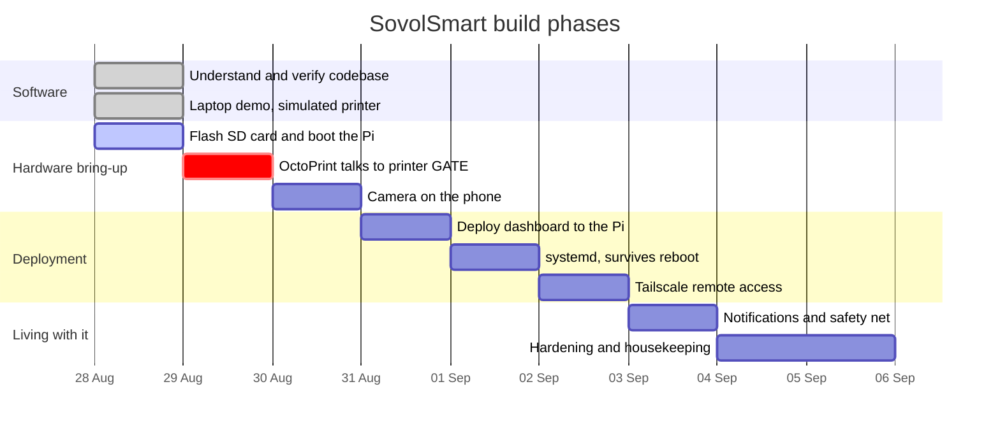
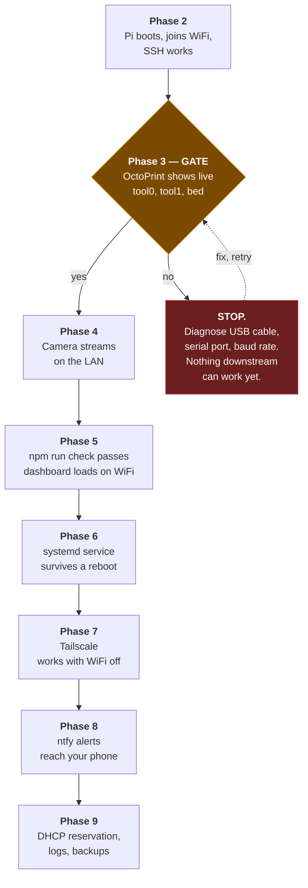

# 02 — Roadmap

**What this document is for:** the plan. What order things happen in, what
counts as "done" for each phase, which steps are gates you must not walk past,
and where we are right now.

Last updated: **28 August 2026**

## Contents

- [Where we are right now](#where-we-are-right-now)
- [The phases at a glance](#the-phases-at-a-glance)
- [The dependency chain](#the-dependency-chain)
- [Phase 0 — Understand and verify (done)](#phase-0--understand-and-verify-done)
- [Phase 1 — Prove it on the laptop (done)](#phase-1--prove-it-on-the-laptop-done)
- [Phase 2 — Bring up the Pi (in progress)](#phase-2--bring-up-the-pi-in-progress)
- [Phase 3 — OctoPrint talks to the printer (the gate)](#phase-3--octoprint-talks-to-the-printer-the-gate)
- [Phase 4 — Camera](#phase-4--camera)
- [Phase 5 — Deploy the dashboard](#phase-5--deploy-the-dashboard)
- [Phase 6 — Make it permanent](#phase-6--make-it-permanent)
- [Phase 7 — Reach it from anywhere](#phase-7--reach-it-from-anywhere)
- [Phase 8 — Notifications and the safety net](#phase-8--notifications-and-the-safety-net)
- [Phase 9 — Hardening and housekeeping](#phase-9--hardening-and-housekeeping)
- [Beyond the roadmap](#beyond-the-roadmap)
- [Risk register](#risk-register)

---

## Where we are right now

| Phase | Status |
|---|---|
| 0 — Understand and verify the codebase | ✅ **Done** |
| 1 — Prove it on the laptop with simulated hardware | ✅ **Done** — running at `http://localhost:8088` |
| 2 — Bring up the Pi | 🟡 **In progress** — SD card being written |
| 3 — OctoPrint talks to the printer | ⬜ Not started — **this is the gate** |
| 4 — Camera | ⬜ Not started |
| 5 — Deploy the dashboard | ⬜ Not started |
| 6 — Make it permanent (systemd) | ⬜ Not started |
| 7 — Reach it from anywhere (Tailscale) | ⬜ Not started |
| 8 — Notifications and the safety net | ⬜ Not started |
| 9 — Hardening and housekeeping | ⬜ Not started |

**Your immediate next action:** when the SD card finishes writing, go to
[Phase 2](#phase-2--bring-up-the-pi-in-progress) and follow
[03 — Pi & OctoPrint runbook](03-pi-and-octoprint-runbook.md).

## The phases at a glance



The durations are nominal — each phase is an evening at most, and several are
twenty minutes. The ordering is what matters, not the calendar.

## The dependency chain

Every phase depends on the one before it. This is not bureaucracy; it is
physics. You cannot test a dashboard that reads temperatures if nothing is
reading temperatures.



---

## Phase 0 — Understand and verify (done)

**Goal:** know exactly what we have before changing anything.

| | |
|---|---|
| **Done** | Read every file in the app. Ran the full test suite: **37 passed, 0 failed**. Documented the architecture in [04](04-application-architecture.md). |
| **Found** | The app is finished and tested — this project is a *deployment*, not a build. One real bug fixed: the mock servers' standalone guard compared `import.meta.url` against a bare `file://` + `process.argv[1]`, which never matches on Windows, so `node test/mocks/octoprint.mjs` silently exited. Now uses `pathToFileURL()`. |
| **Also** | Repository restructured: the redundant `sv02control/sv02-control/` nesting flattened to `sv02-control/`, PDFs and superseded files moved to `reference/`, this `Documents/` folder created. |

## Phase 1 — Prove it on the laptop (done)

**Goal:** see the real interface working against a simulated printer, before
any hardware exists. This is worth doing *first* because it means that when
you do plug things in, you already know what "working" looks like.

**Done.** Running right now on this laptop:

```bash
cd sv02-control
node test/mocks/octoprint.mjs   # fake dual-extruder printer on :5099
node test/mocks/camera.mjs      # fake camera on :5098
npm start                       # the real app on :8088
```

Open **http://localhost:8088**, password **`printer123`**.

`npm run check` reports all green, including `Heaters reported: tool0, tool1,
bed` — the dual-extruder path is exercised.

Nothing is connected and nothing can be damaged. This is the *real* app, not a
mock-up; only the printer and camera behind it are simulated.

> **Note:** `sv02-control/.env` on this laptop currently holds demo values
> pointing at the simulated printer. It is git-ignored and never leaves this
> machine. The Pi gets a completely separate `.env` with real values.

## Phase 2 — Bring up the Pi (in progress)

**Goal:** a Raspberry Pi on your WiFi that you can SSH into.

**Exit criteria:**

- [ ] SD card written with OctoPi, with WiFi SSID, password, **country**,
      hostname `octopi`, and SSH-with-a-password all set in the Imager's gear
      menu *before* writing
- [ ] Card in the Pi, Pi powered, waited 2–3 minutes
- [ ] Pi found on the network (`octopi.local`, or its IP from the router)
- [ ] `ssh <user>@octopi.local` succeeds
- [ ] `uname -m` prints `armv7l` (confirming the 32-bit image — this decides
      the Node version later)

**⚠️ The two things that go wrong here:**

1. **WiFi country not set in the Imager.** Without it the Pi's radio stays
   disabled and it will never appear. The fix is to re-flash — it is faster
   than any workaround.
2. **A combined 2.4/5 GHz network.** The Pi 3B has a **2.4 GHz radio only**.
   If your router broadcasts both bands under one name, the Pi may fail to
   join. Splitting the SSIDs, or temporarily enabling a 2.4 GHz-only guest
   network, fixes it.

Full detail: **[03 — Pi & OctoPrint runbook](03-pi-and-octoprint-runbook.md)**.

## Phase 3 — OctoPrint talks to the printer (the gate)

**Goal:** OctoPrint's own web page shows live, changing temperatures for
`tool0`, `tool1` and `bed`.

**This is the gate. Do not proceed until it passes.** Every remaining phase
reads its data from here. If this does not work, everything downstream will
fail in confusing ways that look like app bugs and are not.

**Exit criteria:**

- [ ] Printer switched on, connected to the Pi with a **data** USB cable
- [ ] `ls /dev/ttyUSB* /dev/ttyACM*` shows a device
- [ ] `http://octopi.local` loads, setup wizard completed
- [ ] **Connect** pressed (baud rate `115200` if `AUTO` fails)
- [ ] Live temperatures appear, and **both hotends** are listed
- [ ] An application key generated: **Settings → Application Keys →
      Generate**, named `sv02-control`, saved somewhere safe

**⚠️ The single most common failure is a charge-only USB cable.** It powers the
printer's port and carries no data. It looks identical to a good cable. If no
`/dev/ttyUSB*` device appears at all, suspect the cable before anything else.

## Phase 4 — Camera

**Goal:** an MJPEG stream the Pi can reach.

**Exit criteria:**

- [ ] IP Webcam installed on the old Android phone, **Start server** tapped
- [ ] Its address noted, e.g. `http://192.168.1.50:8080`
- [ ] Phone propped where it sees the bed, **on a charger**
- [ ] Resolution lowered to ~640×480 (1080p over WiFi gains nothing here)
- [ ] "Keep screen awake" enabled, or background mode on
- [ ] From the Pi: `curl -I http://<phone-ip>:8080/shot.jpg` returns `200 OK`
- [ ] **A DHCP reservation set for the phone in your router** ← this is the
      single most common cause of "the camera stopped working" three weeks later

## Phase 5 — Deploy the dashboard

**Goal:** the dashboard loads on your home WiFi and shows real data.

**Exit criteria:**

- [ ] Node.js installed on the Pi — **Node 20, not 22** (Node 22 dropped
      32-bit ARM; on this image it fails or, worse, half-installs)
- [ ] `sv02-control/` copied to the Pi at `~/sv02-control` (excluding
      `node_modules` — some dependencies are architecture-specific and must be
      installed on the Pi itself)
- [ ] `npm install` run **on the Pi**
- [ ] `.env` created on the Pi from `.env.example` and filled in
- [ ] `npm run check` all green, with `Heaters reported: tool0, tool1, bed`
- [ ] `npm start`, dashboard reachable at `http://octopi.local:8088`
- [ ] Logged in, camera visible, both nozzle temperatures live

## Phase 6 — Make it permanent

**Goal:** it survives a power cut without you.

**Exit criteria:**

- [ ] `deploy/sv02-control.service` copied to `/etc/systemd/system/`
- [ ] `User=` and `WorkingDirectory=` corrected to match reality
- [ ] `sudo systemctl enable --now sv02-control`
- [ ] `systemctl status sv02-control` shows `active (running)`
- [ ] **The Pi rebooted and the dashboard came back on its own** — this is the
      only proof that counts

## Phase 7 — Reach it from anywhere

**Goal:** the dashboard loads on mobile data, with home WiFi switched off.

**Exit criteria:**

- [ ] Tailscale installed on the Pi (`curl -fsSL https://tailscale.com/install.sh | sh`, then `sudo tailscale up`)
- [ ] Tailscale installed on your phone, same account
- [ ] Dashboard loads at the Pi's Tailscale address **with WiFi turned off**
- [ ] `TRUST_PROXY_HTTPS` set appropriately for the chosen access method

**⚠️ Do not forward port 8088 on your router.** That puts a login form on the
public internet protected by a single password, permanently, for anyone in the
world to attack. Tailscale exposes nothing.

## Phase 8 — Notifications and the safety net

**Goal:** your phone tells you when something happens, including when
something goes wrong.

**Exit criteria:**

- [ ] An unguessable ntfy topic chosen (⚠️ **not** `sv02` — anyone who guesses
      the topic name can read your notifications). Something like
      `sv02-k7d2m9x4-printer`.
- [ ] `NTFY_TOPIC_URL` set in the Pi's `.env`
- [ ] ntfy app installed on your phone, subscribed to that topic
- [ ] A test notification received (`npm run check` sends one)
- [ ] A real print started, and the "Print started" notification arrived
- [ ] Decided whether `AUTO_PAUSE_ON_ANOMALY` should be `true`. Default is
      `false`: you get alerted, but nothing pauses without you.

**Also decide the thresholds.** Defaults are 15 °C of deviation held for 30
seconds. Tighter catches faults sooner and cries wolf more often.

## Phase 9 — Hardening and housekeeping

**Goal:** it keeps working in three months without attention.

**Exit criteria:**

- [ ] DHCP reservation for the **phone** (camera) — done in Phase 4
- [ ] DHCP reservation for the **Pi**, so its address stops moving
- [ ] `SESSION_SECRET` set to a real generated value, not left blank (blank
      means a new random one every restart, which logs you out every restart)
- [ ] `APP_PASSWORD` is long. This is reachable from outside the house.
- [ ] Log rotation confirmed working (`data/events.log`, rotates at 2 MB)
- [ ] `journalctl -u sv02-control -f` understood as the way to see what it is doing
- [ ] ⚠️ **A smoke alarm in the room with the printer.** This app is not a fire
      safety device and cannot be one.
- [ ] `.env` confirmed *not* committed to git

## Beyond the roadmap

Things worth doing once the above is solid, in rough order of value per hour
spent. See [07 — Decision log & future work](07-decision-log-and-future-work.md)
for the reasoning.

| Idea | Effort | Value |
|---|---|---|
| **Fit the official Sovol BLTouch kit** — stop levelling by hand, and make the dashboard's existing "Auto bed level" button do something | An afternoon | **High** |
| Timelapse capture from the camera relay | A day | Medium |
| Filament runout sensor | An afternoon | Medium |
| Move the camera to a dedicated Pi camera module or USB webcam | An hour | Medium — frees the phone |
| Convert to Klipper for input shaping and pressure advance | A weekend | Medium, and it unlocks the load-cell probe option |
| Load-cell "nozzle as probe" like a Prusa MK4 | Weeks — a real engineering project | Low, given a BLTouch solves the actual problem |

Full analysis of the probe question, including what Prusa is actually doing
and why the SV02's dual-hotend carriage makes it hard, is in
[nozzle-probe-research.md](../sv02-control/docs/nozzle-probe-research.md).

## Risk register

| Risk | Likelihood | Impact | Mitigation |
|---|---|---|---|
| Pi never joins WiFi (2.4 GHz only, or country not set) | Medium | Blocks everything | Split SSIDs or use a 2.4 GHz guest network; re-flash with the country set |
| Charge-only USB cable | Medium | Looks like a software fault, wastes hours | Test for `/dev/ttyUSB*` first; try a known-good cable |
| Node 22 installed instead of 20 on 32-bit ARM | Medium | Half-broken install, confusing errors | Use the `uname -m` conditional from the runbook |
| Camera phone's IP changes | **High over time** | Camera silently dies weeks later | DHCP reservation — do it in Phase 4, not later |
| Printer feeds 5 V back down the USB line and confuses the Pi | Low | Random Pi reboots | Tape over the USB 5 V pin, or use a power-blocked cable |
| ntfy topic guessed by a stranger | Low | They read your print notifications | Long random topic name |
| `.env` accidentally committed | Low | API key and password in public git history | `.gitignore` covers it; verified before every push |
| Thermal runaway the firmware misses | Very low | **Fire** | Smoke alarm in the room. This app cannot help here. |

---

Next: **[03 — Pi & OctoPrint runbook](03-pi-and-octoprint-runbook.md)**
