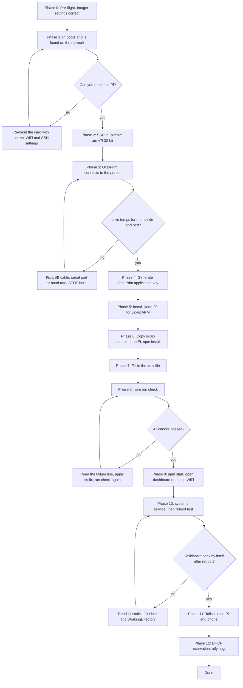
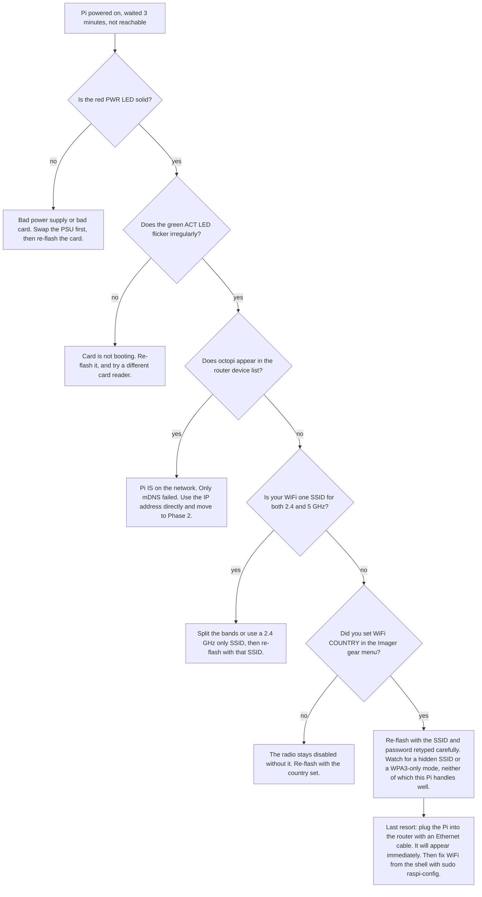
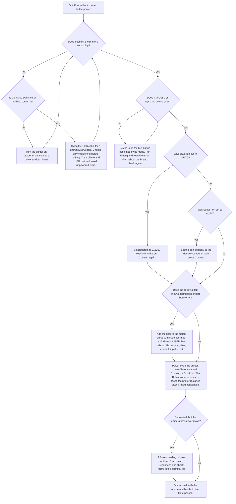

# Raspberry Pi + OctoPrint Bring-Up Runbook

**Purpose.** This is the step-by-step procedure for taking a freshly written OctoPi microSD card and ending with the `sv02-control` dashboard running as a systemd service on a Raspberry Pi 3 Model B, wired by USB to a Sovol SV02 dual-extruder printer, streaming video from an Android phone running IP Webcam, and reachable from outside the house over Tailscale. It is written for an operator who is comfortable with Windows 11 but **not** with Linux: every command says what it does, what a good result looks like, and what to do when it does not. Work the phases in order. Each phase depends entirely on the one before it, and three of them are hard gates — if a gate does not pass, nothing after it can possibly work, so stop and fix it rather than pressing on.

---

## Table of contents

- [How to read this runbook](#how-to-read-this-runbook)
- [The whole sequence at a glance](#the-whole-sequence-at-a-glance)
- [Phase 0 — Pre-flight](#phase-0--pre-flight)
- [Phase 1 — First boot and finding the Pi](#phase-1--first-boot-and-finding-the-pi)
- [Phase 2 — SSH in and verify the machine](#phase-2--ssh-in-and-verify-the-machine)
- [Phase 3 — GATE: OctoPrint sees the printer](#phase-3--gate-octoprint-sees-the-printer)
- [Phase 4 — Generate the OctoPrint application key](#phase-4--generate-the-octoprint-application-key)
- [Phase 5 — Install Node.js on 32-bit ARM](#phase-5--install-nodejs-on-32-bit-arm)
- [Phase 6 — Copy sv02-control from the laptop to the Pi](#phase-6--copy-sv02-control-from-the-laptop-to-the-pi)
- [Phase 7 — Configure .env on the Pi](#phase-7--configure-env-on-the-pi)
- [Phase 8 — GATE: npm run check](#phase-8--gate-npm-run-check)
- [Phase 9 — Run it and open it on the home WiFi](#phase-9--run-it-and-open-it-on-the-home-wifi)
- [Phase 10 — Install the systemd service and prove it survives a reboot](#phase-10--install-the-systemd-service-and-prove-it-survives-a-reboot)
- [Phase 11 — Remote access with Tailscale](#phase-11--remote-access-with-tailscale)
- [Phase 12 — Hardening and housekeeping](#phase-12--hardening-and-housekeeping)
- [Troubleshooting: work backwards](#troubleshooting-work-backwards)
- [Quick-reference command card](#quick-reference-command-card)

---

## How to read this runbook

**Placeholders.** Anything in angle brackets is something you supply. This document never invents a real IP address, password, or key.

| Placeholder | Meaning |
|---|---|
| `<PI_USER>` | the SSH username you set in the Raspberry Pi Imager gear menu |
| `<PI_PASS>` | the SSH password you set in the same place |
| `<PI_IP>` | the Pi's address on your home network, e.g. something in `192.168.x.x` |
| `<PHONE_IP>` | the Android phone's address, shown on the IP Webcam screen |
| `<PHONE_PORT>` | the port IP Webcam shows, usually `8080` |
| `<OCTOPRINT_KEY>` | the application key generated in Phase 4 |
| `<APP_PASSWORD>` | the password you invent for logging into the dashboard |
| `<NTFY_TOPIC>` | the unguessable ntfy topic name generated in Phase 7 |
| `<SESSION_SECRET>` | the 64-character hex string generated in Phase 7 |

**Where each command runs.** Every code block is labelled in the sentence before it. Three places exist:

- **Windows PowerShell** — on your laptop. Windows 11 ships with OpenSSH, so `ssh` and `scp` work natively.
- **Git Bash** — on your laptop, for the handful of things that want a POSIX shell.
- **On the Pi** — after `ssh` has connected. The prompt will look like `<PI_USER>@octopi:~ $`.

**Gates.** Phases 3, 8 and 10 are gates, marked in the text. Do not continue past a gate that has not passed.

**The dependency chain.** Burn this into your head, because it is the whole troubleshooting method:

```
Printer  →  USB cable  →  OctoPrint  →  sv02-control app  →  Tailscale tunnel
```

Each arrow only works if everything to its left works. When something breaks, fix the **leftmost** broken link. Fixing a link to the right of the real fault never works and wastes hours.

---

## The whole sequence at a glance



---

## Phase 0 — Pre-flight

**Goal.** Confirm that the card you have just written will actually produce a Pi that joins your WiFi and accepts SSH. Everything in this phase happens before the card leaves the laptop, or costs you a re-flash later.

### 0.1 What must be true before you start

| Item | Requirement | Why it matters |
|---|---|---|
| Pi model | Raspberry Pi 3 Model B | Its WiFi is **2.4 GHz only** |
| Image | OctoPi stable, from Imager: *Choose OS → Other specific-purpose OS → 3D printing → OctoPi → stable* | Ships OctoPrint pre-installed and pre-enabled |
| microSD | 16 GB or larger, in the Pi | Under 8 GB will run out during `apt` and `npm install` |
| Power supply | A real 5 V 2.5 A Pi supply, not a phone charger | Under-voltage causes random reboots mid-print |
| USB cable | Printer-to-Pi, a **data** cable | Charge-only cables are the single most common silent failure |
| Printer | SV02 powered on, USB plugged in | OctoPrint cannot see a printer that is off |
| Phone | Android, IP Webcam installed, on the same WiFi, on a charger | It is the camera and it must stay awake |
| Laptop | Windows 11, on the **same** WiFi as the Pi | `scp` and `octopi.local` both need this |
| Router access | You can log into its admin page | Needed in Phase 1 and Phase 12 |

### 0.2 The Imager gear-menu settings that must have been set

Before you clicked **Write**, the gear icon (`ctrl+shift+x`) had to have all of these set. There is no way to add them afterwards from Windows without work that is riskier than re-flashing.

| Setting | Correct value | Consequence if missed |
|---|---|---|
| WiFi SSID | your 2.4 GHz network name | Pi never joins the network at all |
| WiFi password | the matching password | Same — Pi is invisible forever |
| **WiFi country** | your actual country code | Radio stays disabled; the Pi boots fine but never joins. This is the most-forgotten field |
| Hostname | `octopi` | `octopi.local` will not resolve; you fall back to IP hunting |
| Enable SSH | ticked, **with password authentication** | You cannot log in at all; the Pi is a brick with no keyboard |
| SSH username | `<PI_USER>` — write it down now | You will be locked out |
| SSH password | `<PI_PASS>` — write it down now | You will be locked out |

### 0.3 The 2.4 GHz trap — read this before you power the Pi on

A Pi 3B has a 2.4 GHz-only radio. Most modern routers broadcast 2.4 GHz and 5 GHz under **one** SSID ("band steering" / "smart connect"). When they do, the Pi frequently cannot join, and the symptom is indistinguishable from a wrong password: it simply never appears.

Do one of these **now**, in your router admin page, not after two hours of debugging:

- Split the bands into two SSIDs, e.g. `<YOURNET>` and `<YOURNET>-5G`, and set the Pi's SSID to the 2.4 GHz one; **or**
- Enable a dedicated 2.4 GHz guest/IoT SSID and use that; **or**
- If your router allows it, disable band steering for this client.

If you already flashed with the combined SSID and the split changes the name, you need Phase 0.4.

### 0.4 If a gear-menu setting was forgotten: re-flash

**Re-flashing is the cheapest fix.** It takes about five minutes and has a 100% success rate. Editing `wpa_supplicant.conf` or `userconf.txt` by hand on the Windows-visible boot partition sometimes works and sometimes silently does not, depending on image version — and you will not know which until you have spent an hour.

Do this:

1. Put the card back in the laptop.
2. Open Raspberry Pi Imager.
3. Choose OS → Other specific-purpose OS → 3D printing → OctoPi → stable.
4. Choose Storage → the card.
5. Gear icon (`ctrl+shift+x`) → set **all seven** rows from the table in 0.2.
6. Write. Wait. Ignore the Windows "You need to format the disk" popup that appears when it finishes — click **Cancel**, never Format.

**Success looks like:** Imager says "Write Successful". Windows may show one small `boot` drive; that is normal, the main Linux partition is invisible to Windows.

**If it fails:** try a different card reader before you blame the card. Cheap readers fail verification constantly.

---

## Phase 1 — First boot and finding the Pi

**Goal.** The Pi boots, joins the 2.4 GHz WiFi, and you learn either that `octopi.local` resolves or what its `<PI_IP>` is.

### 1.1 Boot it

1. Card into the Pi.
2. USB cable from the SV02 into the Pi. **Turn the printer on.**
3. Power into the Pi last.
4. **Wait 3 full minutes.** The first boot resizes the filesystem and reboots itself once. Judging it at 45 seconds is how people conclude a working Pi is broken.

**Success looks like:** the red PWR LED is solid, and the green ACT LED flickers irregularly (disk activity) rather than blinking in a repeating pattern. A green LED blinking in a steady repeating count is an error code.

### 1.2 Try the hostname first — PowerShell

```powershell
ping octopi.local
```

*What it does:* asks Windows to resolve the mDNS name `octopi.local` and send four probe packets.

**Success looks like:**

```
Pinging octopi.local [<PI_IP>] with 32 bytes of data:
Reply from <PI_IP>: bytes=32 time=4ms TTL=64
```

Note the `<PI_IP>` in the square brackets — write it down, you will want it when `.local` gets flaky.

**If it fails** with `Ping request could not find host octopi.local`, that means only that mDNS did not resolve. It does **not** yet mean the Pi is offline. Continue to 1.3.

### 1.3 Ask the router — the most reliable method

Open your router's admin page in a browser (commonly `http://192.168.1.1` or `http://192.168.0.1`; the exact address is on a sticker on the router). Find the page called **Attached Devices**, **DHCP Clients**, **Connected Devices**, or **LAN Status**.

Look for a hostname of `octopi`. If the hostname column is blank, look for a MAC address beginning with **`b8:27:eb`** or **`dc:a6:32`** — those are Raspberry Pi Foundation prefixes.

**Success looks like:** a row showing `octopi` and an IP address. That is your `<PI_IP>`.

**If the Pi is not in the list at all:** it never joined the WiFi. Go to the decision flowchart in 1.6.

### 1.4 Scan the subnet — PowerShell, no extra software

First find out what subnet you are on:

```powershell
ipconfig
```

*What it does:* prints your laptop's network settings. Read the **IPv4 Address** line under your WiFi adapter, e.g. `192.168.1.37`. Your subnet prefix is the first three parts, `192.168.1`.

Now sweep the subnet. Substitute your own prefix for `192.168.1`:

```powershell
1..254 | ForEach-Object -Parallel {
    $ip = "192.168.1.$_"
    if (Test-Connection -ComputerName $ip -Count 1 -Quiet -TimeoutSeconds 1) { $ip }
} -ThrottleLimit 64
```

> `ForEach-Object -Parallel` needs PowerShell 7. On Windows PowerShell 5.1 (the blue `powershell.exe` that ships with Windows 11) use the slower serial form instead:
>
> ```powershell
> 1..254 | ForEach-Object { $ip = "192.168.1.$_"; if (Test-Connection $ip -Count 1 -Quiet) { $ip } }
> ```

*What it does:* pings every address on your subnet and prints the ones that answer.

Then read the ARP table, which now has everything that replied:

```powershell
arp -a
```

or the modern equivalent:

```powershell
Get-NetNeighbor -AddressFamily IPv4 | Where-Object State -ne "Unreachable" | Sort-Object IPAddress
```

*What it does:* lists IP-to-MAC mappings your laptop has learned. Look again for a MAC starting `b8:27:eb` or `dc:a6:32`.

To confirm a candidate is the Pi, test its two open ports:

```powershell
Test-NetConnection -ComputerName <PI_IP> -Port 22
Test-NetConnection -ComputerName <PI_IP> -Port 80
```

**Success looks like:** `TcpTestSucceeded : True` for both. Port 22 is SSH, port 80 is OctoPrint's web interface. A host with both open is almost certainly your Pi.

*If you have nmap installed* (`winget install Insecure.Nmap`), this is one line:

```powershell
nmap -p 22,80 --open 192.168.1.0/24
```

### 1.5 Log the result

Whichever way you found it, you now have one of:

- `octopi.local` resolves — use that everywhere in this document, and keep `<PI_IP>` as a backup.
- Only `<PI_IP>` works — substitute it everywhere this document says `octopi.local`.

### 1.6 Decision flowchart: "the Pi never came online"



The Ethernet fallback is worth remembering: an Ethernet cable from the Pi to your router bypasses every WiFi question at once, gets you a shell, and lets you fix the WiFi properly with `sudo raspi-config` → *System Options* → *Wireless LAN*, which also asks for the country.

---

## Phase 2 — SSH in and verify the machine

**Goal.** Get a shell on the Pi, and confirm two facts that shape Phase 5: that you are actually on the Pi, and that the OS is 32-bit `armv7l`.

### 2.1 Connect — PowerShell

```powershell
ssh <PI_USER>@octopi.local
```

or, if `.local` did not resolve:

```powershell
ssh <PI_USER>@<PI_IP>
```

*What it does:* opens an encrypted shell session on the Pi. Windows 11 has the OpenSSH client built in; no PuTTY needed.

The first connection asks:

```
The authenticity of host 'octopi.local (<PI_IP>)' can't be established.
ED25519 key fingerprint is SHA256:...
Are you sure you want to continue connecting (yes/no/[fingerprint])?
```

Type `yes` and press enter. Then enter `<PI_PASS>`. **Nothing appears as you type the password** — no dots, no stars. That is normal Linux behaviour, not a broken keyboard. Type it and press enter.

**Success looks like** the OctoPi banner and a prompt:

```
Access OctoPrint from a web browser on your network by navigating to any of:
    http://octopi.local
<PI_USER>@octopi:~ $
```

**If it fails:**

| Message | Cause | Fix |
|---|---|---|
| `Connection refused` | SSH was not enabled in the Imager | Re-flash with *Enable SSH* ticked (Phase 0.4) |
| `Permission denied, please try again` | Wrong username or password | The username is the one you typed in the Imager, not necessarily `pi` |
| `Connection timed out` | Wrong address, or you are on a different network than the Pi | Re-run Phase 1; check the laptop is not on a guest network |
| `REMOTE HOST IDENTIFICATION HAS CHANGED` | You re-flashed the card, so the Pi's key is new | Run `ssh-keygen -R octopi.local` then `ssh-keygen -R <PI_IP>` and reconnect |

### 2.2 Confirm what machine you are on — on the Pi

```bash
uname -a
```

*What it does:* prints the kernel name, hostname, kernel version and architecture in one line.

**Success looks like:**

```
Linux octopi 6.1.21-v7+ #1642 SMP Mon Apr 3 17:20:52 BST 2023 armv7l GNU/Linux
```

The parts that matter: the hostname `octopi`, and the architecture `armv7l` at the end.

```bash
uname -m
```

*What it does:* prints just the machine architecture.

**Success looks like:**

```
armv7l
```

**This is the fact that decides Phase 5.** `armv7l` means the operating system is **32-bit**, even though the Pi 3B's processor is 64-bit capable — the standard OctoPi image is built 32-bit. Node.js 22 dropped 32-bit ARM entirely, so installing Node 22 here fails or, worse, half-installs and leaves you with a broken `node` binary. Node 20 is the correct choice, and the app only requires Node 18 or newer, so nothing is lost.

If `uname -m` prints `aarch64` instead, you are on a 64-bit image and Node 22 would be fine — the script in Phase 5 handles both automatically, so you do not need to change anything.

### 2.3 Confirm OctoPrint is already running — on the Pi

```bash
sudo systemctl status octoprint
```

*What it does:* asks the service manager about the OctoPrint background service. OctoPi ships with it enabled, so it should already be up.

**Success looks like:**

```
● octoprint.service - The snappy web interface for your 3D printer
     Loaded: loaded (/etc/systemd/system/octoprint.service; enabled; ...)
     Active: active (running) since ...
```

The words to look for are **`enabled`** (starts on boot) and **`active (running)`**. Press `q` to get your prompt back.

**If it says `inactive (dead)` or `failed`:**

```bash
sudo systemctl enable --now octoprint
sudo journalctl -u octoprint -n 50 --no-pager
```

*What they do:* the first turns the service on now and at every boot; the second prints the last 50 log lines so you can see why it stopped.

### 2.4 Update the package lists — on the Pi

```bash
sudo apt-get update
```

*What it does:* refreshes the catalogue of installable software. It downloads no software itself. Do this before Phase 5, or the Node install may fail on a stale index.

**Success looks like:** several `Get:` and `Hit:` lines ending with `Reading package lists... Done` and no red error text.

**If it fails** with `Could not resolve` or `Temporary failure resolving`, the Pi has WiFi but no working DNS or internet. Check `ping -c 3 1.1.1.1` (raw internet) and `ping -c 3 deb.nodesource.com` (DNS). If the first works and the second does not, it is DNS: reboot the Pi, and if it persists, check your router is handing out a DNS server.

---

## Phase 3 — GATE: OctoPrint sees the printer

> ## ⛔ THIS IS THE GATE THAT MATTERS MOST
>
> The `sv02-control` app **never talks to the printer directly.** It talks to OctoPrint over HTTP, and OctoPrint talks to the printer over USB serial. If OctoPrint cannot see the printer, then no amount of correct `.env` values, Node versions, systemd units or Tailscale configuration will produce a working dashboard. You will just get a beautifully deployed app showing "printer offline".
>
> **Do not proceed to Phase 4 until live temperatures for the nozzle (`tool0`) and the `bed` are visibly updating in the OctoPrint web interface.** If you are tempted to "carry on and come back to it" — that is the mistake this box exists to prevent.

**Goal.** OctoPrint's web UI shows live, changing temperature readings for the nozzle and the bed.

### 3.1 Confirm the printer appears as a serial device — on the Pi

```bash
ls -l /dev/ttyUSB* /dev/ttyACM*
```

*What it does:* lists the USB serial devices Linux has created. The SV02's MKS Robin Nano board appears as one of these two, depending on which USB-to-serial chip it uses.

**Success looks like** one of:

```
crw-rw---- 1 root dialout 188, 0 Aug 28 21:14 /dev/ttyUSB0
```

```
crw-rw---- 1 root dialout 166, 0 Aug 28 21:14 /dev/ttyACM0
```

(An error about the *other* one not existing is expected and fine — you only need one.)

**If neither exists:** the Pi cannot see the printer at the USB level. That is a cable, power or port problem, and OctoPrint is not involved yet. Go to 3.6.

### 3.2 Watch the kernel notice the printer — on the Pi

```bash
dmesg | grep -i tty
```

*What it does:* searches the kernel's boot-and-hardware log for serial-port events.

**Success looks like** a line naming a USB serial adapter attached to a `ttyUSB` or `ttyACM` device, for example:

```
[   12.884] usb 1-1.3: ch341-uart converter now attached to ttyUSB0
```

or

```
[   12.901] cdc_acm 1-1.3:1.0: ttyACM0: USB ACM device
```

The useful trick: run this, then **unplug and replug** the printer's USB cable, and run it again. A working data cable produces new lines at the bottom. A charge-only cable produces **nothing at all** — no new lines, no disconnect message. That comparison is the fastest cable test there is.

To watch it live instead:

```bash
sudo dmesg -w
```

*What it does:* streams new kernel messages as they happen. Unplug and replug the printer and watch. Press `ctrl+c` to stop.

### 3.3 Confirm the USB device is enumerated — on the Pi

```bash
lsusb
```

*What it does:* lists every device on the USB bus.

**Success looks like** a line for the printer's serial chip among the entries, typically one of:

```
Bus 001 Device 005: ID 1a86:7523 QinHeng Electronics CH340 serial converter
Bus 001 Device 005: ID 0483:5740 STMicroelectronics Virtual COM Port
```

**If the printer is not in this list**, Linux does not see the hardware at all. That is a cable or power fault, not a software one. Go to 3.6.

### 3.4 Open OctoPrint and run the setup wizard — in a browser on the laptop

Open:

```
http://octopi.local
```

or `http://<PI_IP>` if the name does not resolve. Note there is **no port number** — OctoPi puts a web server on port 80 that forwards to OctoPrint on port 5000. Both work; the app will use `http://localhost:5000` from the Pi's own point of view.

The first visit shows the **setup wizard**. Work through it:

1. **Access Control** — create an OctoPrint username and password. Write both down. This is a *different* account from `<PI_USER>`/`<PI_PASS>` and different again from `<APP_PASSWORD>`. Do not disable access control.
2. **Online connectivity check** — leave enabled.
3. **Anonymous usage tracking** — your choice, either is fine.
4. **Plugin blacklist** — leave enabled.
5. **Default printer profile** — set **Number of extruders: 2** and **tick "Shared nozzle"**, with bed size 280 × 240 × 300 mm. The SV02 is a **2-in-1-out** machine: two extruder drives feed a **single** nozzle with **one** heater and **one** thermistor. Its firmware confirms it — `M115` reports `EXTRUDER_COUNT:1`, and `M105` answers with a single `T:` reading.

   ⚠️ **Do not read a frozen number as a second sensor.** With shared nozzle ticked, OctoPrint reports the one heater under both `tool0` and `tool1`, so the two values match exactly — that is correct. The trap that caught this build was the opposite: unticking it made `tool1` appear to hold a *different* value, `21.56 °C`, which looked like proof of a second thermistor. It never moved. It was a stale entry, not a sensor. **A real thermistor always jitters.** If a reading holds to two decimal places sample after sample, it is not live. To be certain, send `M115` in OctoPrint's Terminal tab and read `EXTRUDER_COUNT`.
6. Finish, and restart if it asks.

⚠️ **Watch out for the virtual printer.** OctoPi ships with OctoPrint's built-in printer *simulator*, which appears in the serial-port list as `/tmp/printer`. If OctoPrint auto-connects to that instead of `/dev/ttyUSB0`, everything looks perfect — "Operational", temperatures, the lot — but it is a simulation and your printer is not involved. **Always confirm the port says `/dev/ttyUSB0`** (or `/dev/ttyACM0`), never `/tmp/printer`.

**Success looks like:** the OctoPrint dashboard with a "Connection" panel at the top left.

### 3.5 Press Connect — in the browser

In the **Connection** panel on the left:

| Field | Set it to |
|---|---|
| Serial Port | `AUTO`, or explicitly the `/dev/ttyUSB0` or `/dev/ttyACM0` you found in 3.1 |
| Baudrate | `AUTO` first. **If AUTO fails, set `115200`** — that is the SV02's real rate |
| Printer Profile | the one from the wizard |
| Save connection settings | tick it |
| Auto-connect on server startup | tick it — this makes the printer reconnect after a Pi reboot without you touching anything |

Press **Connect**.

**Success looks like — and nothing less than this counts:**

- The Connection panel collapses and shows **State: Operational**.
- The **Temperature** tab shows the **nozzle** and the **Bed** updating every couple of seconds, each with an *Actual* reading near room temperature and a *Target* of 0. With shared nozzle ticked, Tool 0 and Tool 1 show the same value — they are the same heater.
- The Terminal tab shows a stream of lines like `Recv: ok T:21.4 /0.0 B:22.1 /0.0` — **one** `T:` reading, because the SV02 has one heater.

One nozzle reading is correct for the SV02. The dashboard shows it as a single **Nozzle** card tagged `T0+T1`, and keeps both drives available for extrusion.

To prove the temperatures are real rather than a stale cache, set Tool 0's target to 40 °C and watch the Actual value climb. Then set it back to 0.

### 3.6 If OctoPrint will not connect



Two extra notes specific to this hardware:

- **USB back-power.** Some printers feed 5 V back down the USB cable, which confuses the Pi about its own power state. Symptoms are random Pi reboots or a lightning-bolt icon. The fix is a USB cable with the 5 V line cut, or a sliver of tape over the cable's 5 V pin. Try the normal cable first; most setups are fine.
- **Baud rate.** `115200` is the SV02's rate. `250000` is the other value Marlin printers commonly use, so if `115200` produces garbage in the Terminal tab, try `250000` before assuming a hardware fault.

---

## Phase 4 — Generate the OctoPrint application key

**Goal.** Produce the credential `sv02-control` uses to talk to OctoPrint.

### 4.1 Generate it — in the browser

1. In OctoPrint, click the **wrench icon** (Settings) in the top bar.
2. In the left column, under *Features*, click **Application Keys**.
3. In the "Generate a new application key" box, type the application name: `sv02-control`
4. Click **Generate**.
5. A long key appears in the list. Copy it.

**Success looks like:** a row in the Application Keys table with application `sv02-control` and a key that is a long string of hex characters and dashes. That value is your `<OCTOPRINT_KEY>`.

### 4.2 Why an application key rather than the global key

*Settings → API → Global API Key* also works, but the global key unlocks everything and revoking it breaks every other integration at once. An application key can be revoked from this same screen — one click, and only this dashboard stops working. Use the application key.

### 4.3 Handling it safely

- Paste it straight into the Pi's `.env` in Phase 7. Nowhere else.
- Do not put it in a chat message, a screenshot, a commit, or any file outside `.env`.
- `.env` is git-ignored in this project; confirm that before you ever push (`git check-ignore -v .env` should print a match).
- If it does leak, revoke it on this screen and generate a new one. It takes ten seconds.

**If the Application Keys page is missing:** it is a bundled plugin and can be disabled. Re-enable it under *Settings → Plugin Manager → Application Keys Plugin*, or fall back to the Global API Key.

---

## Phase 5 — Install Node.js on 32-bit ARM

**Goal.** A working `node` of version 18 or higher — which on this 32-bit image means Node **20**.

### 5.1 Check what is already there — on the Pi

```bash
node --version
```

*What it does:* prints the installed Node version, if any.

**Success looks like** `v20.x.x` or anything `v18` and above — in which case skip to Phase 6.

**Expected on a fresh OctoPi:** `-bash: node: command not found`. That is normal; continue.

### 5.2 Install the correct major version — on the Pi

Run this exactly as written. It is the same conditional used in the project's own `docs/first-time-setup.md`, and it picks the newest Node that actually runs on whatever architecture you are on:

```bash
# NodeSource no longer publishes 32-bit ARM (armhf) packages at all -- its
# setup script exits with "Unsupported architecture: armhf". The standard
# OctoPi image IS armhf, so use Node's own official tarball instead.
# Node 20 is the last major line with official linux-armv7l builds.
if [ "$(uname -m)" = "aarch64" ]; then
  curl -fsSL https://deb.nodesource.com/setup_22.x | sudo -E bash - && sudo apt-get install -y nodejs
else
  V=v20.20.2
  curl -fsSL -o /tmp/node.tar.xz "https://nodejs.org/dist/$V/node-$V-linux-armv7l.tar.xz"
  sudo tar -xJf /tmp/node.tar.xz -C /usr/local --strip-components=1     --exclude CHANGELOG.md --exclude LICENSE --exclude README.md
  rm /tmp/node.tar.xz
fi
node --version
npm --version
```

*What each line does:*

1. Reads the architecture and sets `MAJOR` to `22` on 64-bit or `20` on 32-bit. On your Pi it will be **20**, because Phase 2.2 showed `armv7l`.
2. Downloads NodeSource's setup script and runs it as root. It adds NodeSource's package repository to the Pi's software sources. `sudo -E` preserves the `MAJOR` variable into the root environment.
3. Installs the `nodejs` package from that new repository.
4. Prints the installed version so you can verify it.

**Success looks like:**

```
v20.19.0
```

(any `v20.x.x` is fine)

Also confirm npm came with it:

```bash
npm --version
```

**Success looks like** a version number such as `10.8.2`.

### 5.3 Why not Node 22

Node 22 dropped support for 32-bit ARM. The standard OctoPi image is 32-bit (`armv7l`) even on a 64-bit-capable Pi 3B. Installing Node 22 on it either fails outright or **half-installs** — leaving a `node` binary that exists but errors with `cannot execute binary file: Exec format error`, which is a genuinely confusing symptom. The conditional above avoids the whole problem. The app declares `"node": ">=18"` in its `package.json`, so Node 20 is comfortably sufficient.

### 5.4 If it fails

| Symptom | Cause | Fix |
|---|---|---|
| `curl: command not found` | curl missing | `sudo apt-get install -y curl` then retry |
| `Could not resolve host deb.nodesource.com` | DNS not working | `ping -c 3 1.1.1.1`; if that works it is DNS — reboot, then check the router's DNS setting |
| `node --version` prints nothing, or `Exec format error` | Wrong architecture installed | `sudo apt-get remove -y nodejs && sudo apt-get autoremove -y`, then re-run 5.2 and watch that it says 20 |
| `E: Unable to locate package nodejs` | The NodeSource step failed silently | Re-run step 2 alone and read its output; then `sudo apt-get update` and retry |
| Install succeeds but the version is v12 or v14 | Debian's own old package won `apt` priority | `sudo apt-get remove -y nodejs libnode-dev npm && sudo apt-get autoremove -y`, then re-run 5.2 |

**Do not continue until `node --version` prints a v18+ version.** This is the second most common place the whole build stalls.

---

## Phase 6 — Copy sv02-control from the laptop to the Pi

**Goal.** The whole project folder lands at `/home/<PI_USER>/sv02-control` on the Pi, without `node_modules`, and `npm install` succeeds there.

### 6.1 Why `node_modules` must be excluded

Some npm dependencies compile native code for the specific CPU. A `node_modules` folder built on Windows x64 is useless — and actively harmful — on 32-bit ARM Linux. It also contains tens of thousands of small files, which turns a 30-second copy into a 20-minute one over SSH. Dependencies get installed **on the Pi**.

### 6.2 The clean-copy method — PowerShell (recommended)

`scp` has no exclude option, so stage a clean copy first with `robocopy`, which does.

```powershell
robocopy "E:\3D_Prints\Printer_Smart\sv02-control" "$env:TEMP\sv02-control" /MIR /XD node_modules .git data /XF .env
```

*What it does:* mirrors the project into a temporary folder, excluding the `node_modules`, `.git` and `data` **directories** (`/XD`) and the `.env` **file** (`/XF`). You will create a fresh `.env` on the Pi in Phase 7; copying your laptop's demo `.env` over would put demo values on the real machine.

> `robocopy` exit codes 0–7 mean success. Exit code 1 ("files copied") is normal and is *not* an error, despite PowerShell sometimes styling it like one.

Then copy it up:

```powershell
scp -r "$env:TEMP\sv02-control" <PI_USER>@octopi.local:~/
```

*What it does:* recursively copies the staged folder to the Pi's home directory, creating `/home/<PI_USER>/sv02-control`. You will be asked for `<PI_PASS>`.

**Success looks like:** a list of filenames scrolling past with per-file progress percentages, ending back at your PowerShell prompt with no error.

### 6.3 Alternative — Git Bash, one command, no staging

If you prefer Git Bash, `tar` can stream the folder over SSH with exclusions applied on the fly:

```bash
cd /e/3D_Prints/Printer_Smart
tar --exclude=node_modules --exclude=.git --exclude=data --exclude=.env -czf - sv02-control \
  | ssh <PI_USER>@octopi.local "tar -xzf - -C ~/"
```

*What it does:* compresses the folder to standard output, pipes it through SSH, and untars it into the Pi's home directory. Faster than `scp -r` on folders with many files, because it is one stream rather than thousands of round trips.

### 6.4 Alternative — clone from GitHub on the Pi

If the project is already pushed to `https://github.com/Bharadhwajreddy/SovolSmart`, skip the copy entirely:

```bash
sudo apt-get install -y git
git clone https://github.com/Bharadhwajreddy/SovolSmart.git ~/SovolSmart
cp -r ~/SovolSmart/sv02-control ~/sv02-control
```

### 6.5 Verify the copy — on the Pi

```bash
ls -la ~/sv02-control
```

**Success looks like** entries including `package.json`, `server`, `public`, `scripts`, `deploy`, `test` and `.env.example`, and **no** `node_modules`.

Confirm the essential files specifically:

```bash
ls ~/sv02-control/scripts/check.mjs ~/sv02-control/deploy/sv02-control.service ~/sv02-control/.env.example
```

**Success looks like** all three paths echoed back with no `No such file` errors.

> If `.env.example` is missing, `scp` may have skipped dotfiles. Copy it explicitly:
> ```powershell
> scp "E:\3D_Prints\Printer_Smart\sv02-control\.env.example" <PI_USER>@octopi.local:~/sv02-control/
> ```

### 6.6 Install dependencies — on the Pi

```bash
cd ~/sv02-control
npm install
```

*What it does:* reads `package.json` and downloads `express` and `multer` (and their dependencies) built for this machine.

**Success looks like:**

```
added 78 packages, and audited 79 packages in 21s
found 0 vulnerabilities
```

Package counts vary; what matters is `added N packages` and no red `ERR!` lines.

**If it fails:**

| Symptom | Fix |
|---|---|
| `npm: command not found` | Phase 5 did not complete. Go back and finish it |
| `EACCES: permission denied` | You are in the wrong folder or copied as root. `sudo chown -R $USER:$USER ~/sv02-control` then retry. **Never** run `npm install` with `sudo` |
| `ENOTFOUND registry.npmjs.org` | No internet or DNS. Same check as Phase 5.4 |
| Hangs for minutes | Normal on a Pi 3B over WiFi. Give it five minutes before intervening |
| `ENOSPC: no space left on device` | Card is full. `df -h` to confirm; a bigger card is the answer |

---

## Phase 7 — Configure `.env` on the Pi

**Goal.** A complete, correct `/home/<PI_USER>/sv02-control/.env`.

### 7.1 Generate the two values that must be generated — on the Pi

Session secret:

```bash
node -e "console.log(require('crypto').randomBytes(32).toString('hex'))"
```

*What it does:* prints a 64-character random hex string used to sign login cookies. **Success looks like** a long unbroken run of hex characters. Copy it — that is `<SESSION_SECRET>`. If you leave `SESSION_SECRET` blank, the app generates a new one at every start, which logs you out on every restart and every reboot.

An unguessable ntfy topic name:

```bash
echo "sv02-$(node -e "console.log(require('crypto').randomBytes(6).toString('hex'))")"
```

*What it does:* prints something like `sv02-` followed by twelve random hex characters. **Success looks like** a single line beginning `sv02-`. That is `<NTFY_TOPIC>`.

ntfy.sh has no accounts and no passwords: **anyone who knows the topic name can read your notifications, and send you fake ones.** So it must not be guessable. Never use `sv02`, `printer`, or your name. Write `<NTFY_TOPIC>` down — you need it on your phone in Phase 12.

### 7.2 Create the file — on the Pi

```bash
cd ~/sv02-control
cp .env.example .env
nano .env
```

*What they do:* copy the fully commented template to the real filename, then open it in `nano`, a simple text editor.

**nano survival guide:** arrow keys move; there is no mouse. `ctrl+k` cuts a line, `ctrl+u` pastes it. To save: `ctrl+o`, then `enter` to confirm the filename. To exit: `ctrl+x`. Pasting into nano over SSH is a normal right-click or `ctrl+shift+v` in Windows Terminal.

### 7.3 Every value, and where it comes from

| Variable | Value to set | Where it comes from | Required? |
|---|---|---|---|
| `OCTOPRINT_URL` | `http://localhost:5000` | Fixed. OctoPrint runs on this same Pi, so localhost is fastest and never breaks when the IP changes. Not port 80 — that is the proxy | **Yes** |
| `OCTOPRINT_API_KEY` | `<OCTOPRINT_KEY>` | Phase 4. Must not be left as `changeme` or the app refuses to boot | **Yes** |
| `APP_PASSWORD` | `<APP_PASSWORD>` | You invent it. Minimum 8 characters, and make it long — this is the only thing between the internet and your printer's controls. Not the same as `<PI_PASS>` or the OctoPrint password | **Yes** |
| `PHONE_CAMERA_URL` | `http://<PHONE_IP>:<PHONE_PORT>/video` | The IP Webcam app shows the base address on screen when you tap *Start server*. Pasting the bare `http://<PHONE_IP>:8080` also works — the app appends `/video` for you | Strongly recommended |
| `PHONE_SNAPSHOT_URL` | leave **blank** | Derived automatically as `http://<PHONE_IP>:<PHONE_PORT>/shot.jpg`. Only set it if your camera is unusual | No |
| `CAMERA_USERNAME` | blank, unless you set a login inside IP Webcam | The IP Webcam app's own settings | No |
| `CAMERA_PASSWORD` | blank, unless you set a login inside IP Webcam | Same | No |
| `NTFY_TOPIC_URL` | `https://ntfy.sh/<NTFY_TOPIC>` | Phase 7.1. Blank disables push notifications; in-app banners still work | Recommended |
| `NTFY_TOKEN` | leave blank | Only for a private or self-hosted ntfy server | No |
| `TEMP_DEVIATION_C` | `15` | Default. How far (°C) a heater may drift from target before it counts as an anomaly | No |
| `TEMP_DEVIATION_SECONDS` | `30` | Default. How long the drift must persist before firing. Stops one bad reading from crying wolf | No |
| `AUTO_PAUSE_ON_ANOMALY` | `false` to start | Default. `true` pauses the print automatically on an anomaly. Leave it `false` until you trust the detection on your own printer | No |
| `PORT` | `8088` | Default. The dashboard's port. Change only if something else on the Pi already uses 8088 | No |
| `SESSION_SECRET` | `<SESSION_SECRET>` | Phase 7.1. Blank means a new secret each start, so every restart logs you out | Strongly recommended |
| `SESSION_HOURS` | `720` | Default — a 30-day login. Lower it if you want to be asked more often | No |
| `TRUST_PROXY_HTTPS` | **`false`** | See 7.4 below. The shipped example says `true`; for a Tailscale setup that is wrong | **Yes, check this** |
| `LOG_FILE` | `./data/events.log` | Default. Where anomalies and events are recorded | No |

### 7.4 The `TRUST_PROXY_HTTPS` trap

Set this to `true` **only** when something in front of the app terminates TLS for you — Cloudflare Tunnel, OctoEverywhere, or an nginx with a certificate. `true` marks the login cookie `Secure`, which means the browser refuses to send it over plain `http://`.

In this build you will reach the dashboard over plain HTTP both on the home WiFi (`http://octopi.local:8088`) and over Tailscale (`http://<pi-tailscale-name>:8088`). Tailscale encrypts the transport itself but does not present HTTPS to the browser. So:

```
TRUST_PROXY_HTTPS=false
```

The symptom of getting this wrong is distinctive and maddening: **you type the password, the page reloads, and you are back at the login form with no error message.** The login succeeded; the cookie was simply thrown away. If you ever put Cloudflare Tunnel in front of this, flip it back to `true`.

### 7.5 What the finished file should look like

The essential lines, with placeholders where your real values go:

```
OCTOPRINT_URL=http://localhost:5000
OCTOPRINT_API_KEY=<OCTOPRINT_KEY>
APP_PASSWORD=<APP_PASSWORD>
PHONE_CAMERA_URL=http://<PHONE_IP>:<PHONE_PORT>/video
PHONE_SNAPSHOT_URL=
NTFY_TOPIC_URL=https://ntfy.sh/<NTFY_TOPIC>
TEMP_DEVIATION_C=15
TEMP_DEVIATION_SECONDS=30
AUTO_PAUSE_ON_ANOMALY=false
PORT=8088
SESSION_SECRET=<SESSION_SECRET>
SESSION_HOURS=720
TRUST_PROXY_HTTPS=false
LOG_FILE=./data/events.log
```

Save with `ctrl+o`, `enter`, `ctrl+x`.

### 7.6 Verify it without exposing the secrets — on the Pi

```bash
grep -E "^(OCTOPRINT_URL|APP_PASSWORD|PHONE_CAMERA_URL|NTFY_TOPIC_URL|TRUST_PROXY_HTTPS|PORT)=" .env
```

*What it does:* prints only the non-secret lines so you can eyeball them. It deliberately omits the API key and the session secret.

Then confirm no placeholder survived:

```bash
grep -n "changeme" .env
```

**Success looks like:** no output at all. Any line printed here is one you forgot to fill in, and the app will refuse to start because of it.

Lock the file down so only you can read it:

```bash
chmod 600 .env
ls -l .env
```

**Success looks like** `-rw-------` at the start of the line.

### 7.7 Common `.env` mistakes

| Mistake | Symptom |
|---|---|
| Quotes around values, e.g. `APP_PASSWORD="secret"` | Usually handled — the loader strips matching quotes — but mismatched ones become part of the password |
| Spaces around `=` | The key is parsed with the space attached and silently ignored |
| A trailing slash on `OCTOPRINT_URL` | Handled, trailing slashes are stripped, but do not rely on it |
| Using `http://octopi.local:5000` instead of localhost | Works until mDNS hiccups, then the dashboard drops the printer for no visible reason |
| Using port `80` for `OCTOPRINT_URL` | Often works via the proxy, but `5000` is the direct, correct port |
| A `#` comment on the same line as a value | The `#` and everything after it becomes part of the value |

---

## Phase 8 — GATE: `npm run check`

> ## ⛔ SECOND GATE
> `npm run check` tests, from the Pi itself, everything the app depends on: config validity, the OctoPrint connection, the API key, whether the printer is actually connected, the camera stream, and notifications. **Do not run `npm start` until this passes.** Every failure it prints names its own cause and its own fix.

### 8.1 Run it — on the Pi

```bash
cd ~/sv02-control
npm run check
```

### 8.2 Exactly what a pass looks like

```
Configuration
  ✓ Required settings are present.

OctoPrint  (http://localhost:5000)
  ✓ Connected in 141ms — OctoPrint 1.10.0
  ✓ Printer connected. Heaters reported: bed, tool0

Camera  (http://<PHONE_IP>:<PHONE_PORT>/video)
  ✓ Connected in 109ms — multipart/x-mixed-replace
  ✓ Video is streaming (4096 bytes sampled).
  ✓ Snapshot fallback works (http://<PHONE_IP>:<PHONE_PORT>/shot.jpg).

Notifications  (https://ntfy.sh/<NTFY_TOPIC>)
  ✓ Test notification sent — check your phone.

All checks passed. Start the app with: npm start
```

**The single most important line is `Heaters reported: bed, tool0`.** If it lists no heaters, the printer is not really connected — go back to Phase 3. It may also say *Only one hotend is reported*: on the SV02 that is correct, because both drives share one nozzle.

The script exits with status `0` on success and `1` on failure, so `echo $?` afterwards tells you the result if the output has scrolled away.

### 8.3 Every failure it can report, and its fix

**Configuration section**

| Message | Cause | Fix |
|---|---|---|
| `✗ OCTOPRINT_API_KEY is not set (see .env.example)` | Key missing or still `changeme` | Paste `<OCTOPRINT_KEY>` from Phase 4 into `.env` |
| `✗ APP_PASSWORD is not set, or is still the placeholder` | Left as `changeme` | Set a real password |
| `✗ APP_PASSWORD must be at least 8 characters` | Too short | Lengthen it. This is deliberate — it is your internet-facing password |
| `✗ OCTOPRINT_URL is not set` | Line blank or deleted | Set `OCTOPRINT_URL=http://localhost:5000` |

**OctoPrint section**

| Message | Cause | Fix |
|---|---|---|
| `✗ Cannot reach OctoPrint. Connection refused — the address is right but nothing is listening on that port.` | OctoPrint is not running, or `OCTOPRINT_URL` has the wrong port | `sudo systemctl status octoprint`; start it with `sudo systemctl enable --now octoprint`. Confirm the URL is port `5000` |
| `✗ Cannot reach OctoPrint. Hostname could not be resolved.` | You used a `.local` name that failed to resolve | Use `http://localhost:5000` |
| `✗ Cannot reach OctoPrint. Timed out.` | Firewall, or a URL pointing at another machine | Use `localhost`; check nothing else is filtering |
| `✗ Cannot reach OctoPrint. No route to that address.` | URL points off this network | Use `localhost` |
| `✗ Reached OctoPrint, but it rejected the API key.` | Wrong, truncated, or revoked key | Regenerate under *Settings → Application Keys* and update `.env`. Check for a stray space or a truncated paste |
| `✗ OctoPrint answered with HTTP 5xx` | OctoPrint itself is unwell | `sudo journalctl -u octoprint -n 50 --no-pager`, then `sudo systemctl restart octoprint` |
| `✗ OctoPrint is running, but the printer is not connected to it.` | HTTP 409 — OctoPrint is up but has no serial link | **Back to Phase 3.** Printer on, data cable, press Connect, baud `115200` |
| `Heaters reported: none` | Connected but reporting nothing | Power-cycle the printer, reconnect in OctoPrint, check the Terminal tab for `T:` lines |
| `Only one hotend is reported. That is fine — the dashboard adapts.` | Printer profile says 1 extruder | Not fatal, but **wrong for an SV02.** Set extruders to 2 in the printer profile and reconnect |

**Camera section**

| Message | Cause | Fix |
|---|---|---|
| `✗ PHONE_CAMERA_URL is not set.` | Blank in `.env` | Open IP Webcam, tap *Start server*, use the address it shows |
| `✗ Cannot reach the camera. Timed out.` | Phone asleep, screen locked, or IP Webcam stopped | Wake the phone, restart the server in the app, enable *Keep screen awake*, keep it on a charger |
| `✗ Cannot reach the camera. Connection refused.` | Right IP, IP Webcam not serving | Tap *Start server* again; check the port matches |
| `✗ Cannot reach the camera. Hostname could not be resolved.` | A name was used where an IP belongs | Use the numeric `<PHONE_IP>` |
| `✗ Cannot reach the camera. No route to that address.` | Phone on mobile data or a guest WiFi | Put the phone on the same WiFi as the Pi |
| Reached, but the IP is wrong now | DHCP gave the phone a new address | **This is the classic silent failure.** Set a DHCP reservation — Phase 12.1 |
| `✗ Camera answered with HTTP 401.` | IP Webcam has a login set | Set `CAMERA_USERNAME` and `CAMERA_PASSWORD` in `.env` |
| `✗ Camera answered with HTTP 4xx/5xx` | Wrong path | The stream path is `/video`; the still path is `/shot.jpg` |
| `That is a single image, not a stream.` | URL points at `/shot.jpg` | Not fatal — the app falls back to still frames. Point it at `/video` for smooth video |
| `Unexpected content type: ...` | Not an MJPEG endpoint | Confirm the URL in a laptop browser first; it should show live video |
| `Snapshot fallback unavailable — not fatal.` | No `/shot.jpg` on that camera | Ignore, or set `PHONE_SNAPSHOT_URL` explicitly |

**Notifications section**

| Message | Cause | Fix |
|---|---|---|
| `NTFY_TOPIC_URL is not set, so nothing will reach your phone.` | Blank (informational) | Set it if you want push alerts; in-app banners work regardless |
| `✗ Could not send a test notification. HTTP 4xx` | Malformed topic URL | Must be exactly `https://ntfy.sh/<NTFY_TOPIC>` — no trailing slash, no extra path |
| `✗ Could not send a test notification. Timed out.` | Pi has no internet | `ping -c 3 ntfy.sh` from the Pi |
| Says sent, but nothing arrives on the phone | Not subscribed, or a typo in the topic | Subscribe in the ntfy app to the identical topic name — Phase 12.2 |

### 8.4 Iterate

Fix one thing, re-run `npm run check`, repeat. It is fast and it is the single best diagnostic in the project. When something seems wrong at any point in the future — weeks from now — this is the first command to run.

---

## Phase 9 — Run it and open it on the home WiFi

**Goal.** See the dashboard in a browser, logged in, with live camera and both hotend temperatures.

### 9.1 Start it in the foreground — on the Pi

```bash
cd ~/sv02-control
npm start
```

*What it does:* runs `node server/index.js` attached to your terminal. Closing the SSH session stops it. That is intentional for this phase — you want to see the log output directly.

**Success looks like** startup lines naming the port, e.g.:

```
SV02 Control listening on http://0.0.0.0:8088
```

Any warnings about a missing camera URL, ntfy topic, or session secret appear here too. They are advisory, not fatal — but if you see the `SESSION_SECRET is not set` warning, go back to Phase 7.1, because you will otherwise be logged out at every restart.

### 9.2 Open it — in a browser on the laptop

```
http://octopi.local:8088
```

or `http://<PI_IP>:8088`. Log in with `<APP_PASSWORD>`.

**Success looks like** the dashboard, showing:

- The camera view as the main panel, with live moving video.
- **Two** nozzle temperatures plus the bed, each with current and target values.
- Progress, elapsed and remaining time (all idle if nothing is printing).
- Working controls: pause, resume, cancel, home, cooldown, emergency stop.

Test it from your phone on the same WiFi too — the same URL. That is how you will actually use it.

### 9.3 If it does not work

| Symptom | Cause | Fix |
|---|---|---|
| Browser shows `ERR_CONNECTION_REFUSED` | App is not running, or crashed at startup | Look at the Pi terminal for an error. Re-run Phase 8 |
| Page loads, login always bounces back to login | `TRUST_PROXY_HTTPS=true` over plain HTTP | Set `TRUST_PROXY_HTTPS=false`, `ctrl+c`, `npm start` again — Phase 7.4 |
| `Error: listen EADDRINUSE :::8088` | Port already in use, often an earlier copy of this app | `pkill -f "node server/index.js"` then restart, or change `PORT` |
| Dashboard loads but says printer offline | OctoPrint lost the serial link | Phase 3: reconnect in OctoPrint, and tick *Auto-connect on server startup* |
| Camera panel blank or spinning | Phone asleep, or its IP changed | Wake the phone, re-run `npm run check`, then Phase 12.1 |
| Only one hotend shown | Printer profile has 1 extruder | Phase 3.5 |
| Works on the laptop, not on the phone | Phone on mobile data | Turn the phone's WiFi on and join the home network |
| `octopi.local:8088` fails but `<PI_IP>:8088` works | mDNS is unreliable on this network | Use the IP, and give the **Pi** a DHCP reservation too so it never changes |

Stop it with `ctrl+c` when you are satisfied. Phase 10 makes it permanent.

---

## Phase 10 — Install the systemd service and prove it survives a reboot

> ## ⛔ THIRD GATE
> The reboot test is the gate. An app that runs only while you are watching is not deployed. If the dashboard does not come back **by itself** after a power cut, it will be down the next time you actually need it.

**Goal.** `sv02-control` starts automatically at boot, restarts itself if it crashes, and logs to the system journal.

### 10.1 Install the unit file — on the Pi

```bash
cd ~/sv02-control
sudo cp deploy/sv02-control.service /etc/systemd/system/
```

*What it does:* copies the shipped service definition into the directory where systemd looks for units. `sudo` is needed because that directory is owned by root.

### 10.2 Correct the two lines that must match your machine

The shipped file assumes the username `pi`. Yours is `<PI_USER>`, which may not be `pi`. Confirm what to write:

```bash
whoami
pwd
```

*What they do:* print your username and your current directory (which should be `/home/<PI_USER>/sv02-control`).

Now edit:

```bash
sudo nano /etc/systemd/system/sv02-control.service
```

Set exactly these two lines to what the commands above printed:

```
User=<PI_USER>
WorkingDirectory=/home/<PI_USER>/sv02-control
```

Leave everything else alone. For reference, the shipped unit already does the right things: `After=network-online.target octoprint.service` so it starts after the network and after OctoPrint; `Wants=` rather than `Requires=` so the dashboard still comes up and shows "printer offline" when OctoPrint is down; `Restart=always` with `RestartSec=5` so a crash is recovered without spinning the CPU; and `ExecStart=/usr/bin/node server/index.js`.

Verify Node really is at that path:

```bash
which node
```

**Success looks like** `/usr/bin/node`. If it prints something else (`/usr/local/bin/node`, or an nvm path), edit `ExecStart=` to match, because systemd does not use your shell's `PATH`.

Save with `ctrl+o`, `enter`, `ctrl+x`.

### 10.3 Enable and start it

```bash
sudo systemctl daemon-reload
sudo systemctl enable --now sv02-control
sudo systemctl status sv02-control
```

*What each does:*

1. `daemon-reload` makes systemd re-read unit files from disk. Required after any edit — skipping it means your change is ignored and you debug a file systemd never read.
2. `enable --now` does two things at once: `enable` registers it to start at every boot, `--now` starts it immediately.
3. `status` shows whether it is actually running.

**Success looks like:**

```
● sv02-control.service - SV02 Control — remote monitoring and control for the Sovol SV02
     Loaded: loaded (/etc/systemd/system/sv02-control.service; enabled; preset: enabled)
     Active: active (running) since Thu 2026-08-28 21:40:12 IST; 3s ago
   Main PID: 1487 (node)
      Tasks: 11 (limit: 780)
```

Both words matter: **`enabled`** (comes back at boot) and **`active (running)`** (up right now). Press `q` to return to the prompt.

Reload the dashboard in your browser — it should be there, now running without any SSH session attached.

### 10.4 If the service will not start

```bash
sudo journalctl -u sv02-control -n 50 --no-pager
```

*What it does:* prints the last 50 log lines for this service. `--no-pager` dumps them straight out rather than into a scrolling viewer.

| Journal line | Cause | Fix |
|---|---|---|
| `status=203/EXEC` | `ExecStart` path is wrong | `which node` and correct `ExecStart=` |
| `status=200/CHDIR` | `WorkingDirectory` does not exist | Fix the path; it is case-sensitive |
| `Failed to determine user credentials`, `217/USER` | `User=` is not a real account | Set it to what `whoami` printed |
| `Cannot find module '/home/.../server/index.js'` | Wrong `WorkingDirectory`, or the copy is incomplete | Re-check Phase 6.5 |
| `Cannot find module 'express'` | `npm install` was never run on the Pi | `cd ~/sv02-control && npm install` |
| `OCTOPRINT_API_KEY is not set` | The service cannot read `.env` | `.env` must be in `WorkingDirectory` and readable by `User=`. Check `ls -l ~/sv02-control/.env`, and `chown <PI_USER>:<PI_USER> .env` if needed |
| `EADDRINUSE :::8088` | Your Phase 9 `npm start` is still running | `pkill -f "node server/index.js"`, then `sudo systemctl restart sv02-control` |
| Restarts in a loop every 5 seconds | A fatal config error | `journalctl -u sv02-control -f` and read the error at each restart |

Whenever you edit the unit file: `sudo systemctl daemon-reload && sudo systemctl restart sv02-control`.

### 10.5 The reboot test — this is the gate

```bash
sudo reboot
```

*What it does:* restarts the Pi. Your SSH session will drop with `client_loop: send disconnect` — that is expected.

**Wait 2 minutes.** The Pi 3B is not fast.

Then, from the laptop, with **no SSH session open**, open:

```
http://octopi.local:8088
```

**Success looks like:** the login page appears, you log in, and you see live temperatures and live camera — all without you having started anything. That means the whole stack (OctoPrint auto-connecting to the printer, and `sv02-control` auto-starting) survives a power cut.

**If the dashboard does not come back:**

```powershell
ssh <PI_USER>@octopi.local
```

then on the Pi:

```bash
sudo systemctl status sv02-control
sudo systemctl status octoprint
sudo journalctl -u sv02-control -b --no-pager | tail -40
```

*What `-b` does:* limits the journal to the current boot, so you see only what happened since this restart.

| Finding | Fix |
|---|---|
| `sv02-control` is `disabled` | You ran `start` instead of `enable`. `sudo systemctl enable sv02-control` |
| `sv02-control` failed, OctoPrint fine | Read the journal; use the table in 10.4 |
| Both running, but the printer is offline in OctoPrint | Tick *Auto-connect on server startup* in the OctoPrint Connection panel |
| Camera missing after reboot | The phone's IP changed. Phase 12.1 |
| Pi never came back at all | Under-voltage or SD corruption. Better PSU; check the kernel log for voltage warnings |

---

## Phase 11 — Remote access with Tailscale

**Goal.** Reach the dashboard from your phone on mobile data, with nothing exposed to the public internet.

### 11.1 Why not port forwarding

Forwarding port 8088 on your router puts a login form on the public internet, protected by a single password, running on a Pi you will forget to update, wired to a machine that gets hot enough to start a fire. Every scanner on the internet finds it within hours. There is no version of this that is a good idea for a printer.

Tailscale instead builds an encrypted private network between your own devices. The Pi is reachable **only** by devices signed into your Tailscale account. Nothing is exposed, so nobody can even attempt to log in. It is also free for personal use and needs no router configuration at all — no port forwarding, no dynamic DNS, no certificates.

### 11.2 Install Tailscale on the Pi

```bash
curl -fsSL https://tailscale.com/install.sh | sh
```

*What it does:* detects the OS and architecture and installs the correct Tailscale package. It handles 32-bit ARM correctly.

**Success looks like** `Installation complete! Log in to start using Tailscale by running: sudo tailscale up`.

```bash
sudo tailscale up
```

*What it does:* starts Tailscale and prints a one-time login URL, e.g. `https://login.tailscale.com/a/xxxxxxxx`.

Copy that URL into a browser on your laptop and sign in (Google, Microsoft or GitHub — no new account needed). Use the **same** account you will use on the phone.

**Success looks like** the browser saying the device is connected, and the Pi's terminal returning to a prompt.

```bash
tailscale ip -4
```

*What it does:* prints the Pi's Tailscale address, which is in the `100.x.y.z` range. Write it down.

```bash
tailscale status
```

*What it does:* lists every device on your tailnet and whether it is online.

### 11.3 Install Tailscale on the phone

1. Play Store → **Tailscale** → Install.
2. Open it and sign in with the **same account** you used in 11.2.
3. Toggle the VPN on. Android will ask to allow a VPN connection — accept.

**Success looks like** the Tailscale app listing your Pi (`octopi`) as a connected device.

### 11.4 Prove it works from outside

1. **Turn the phone's WiFi completely off.** It must be on mobile data — this is the actual test.
2. Confirm Tailscale is still on.
3. Open a browser and go to:

```
http://100.x.y.z:8088
```

using the address from `tailscale ip -4`. If Tailscale's MagicDNS is enabled (it is by default), this shorter form also works:

```
http://octopi:8088
```

**Success looks like:** the login page, `<APP_PASSWORD>` accepted, live camera and live temperatures — over mobile data, with your home WiFi not involved at all.

**If it fails:**

| Symptom | Fix |
|---|---|
| Login page loads, password bounces back to login | `TRUST_PROXY_HTTPS` is `true`. It must be `false` for plain-HTTP Tailscale — Phase 7.4 |
| Cannot reach it at all | Check both devices show online in the Tailscale app. Both must be on the same account |
| `http://octopi:8088` fails but `100.x.y.z:8088` works | MagicDNS is off. Enable it in the Tailscale admin console, or just use the numeric address |
| Works on WiFi, not on mobile data | The phone's VPN toggle is off, or Android battery optimisation killed Tailscale. Exclude Tailscale from battery optimisation |
| Dashboard loads but the camera is blank | Expected if the *phone* is the camera and it has left the WiFi. The Pi fetches the stream from the phone over the **local** network, so the camera only works while the phone is home on WiFi. Watching remotely means the phone stays home as the camera and you watch from a different device |

### 11.5 Make the Pi's Tailscale connection permanent

```bash
sudo systemctl enable tailscaled
sudo tailscale up --ssh
```

*What they do:* the first ensures Tailscale starts at boot; the second re-establishes the connection and additionally allows SSH over the tailnet, so you can administer the Pi from outside the house without exposing port 22 to anyone.

Reboot once more and confirm `tailscale status` still shows the Pi connected.

### 11.6 If you genuinely need a public shareable URL

Only if someone without a Tailscale account must see the dashboard:

```bash
cloudflared tunnel --url http://localhost:8088
```

This prints a public `https://something.trycloudflare.com` address. If you use this route, set `TRUST_PROXY_HTTPS=true` in `.env` and restart the service, because Cloudflare does terminate TLS. Understand what you are doing: this genuinely does put your dashboard on the public internet behind one password. Tailscale is the better default.

---

## Phase 12 — Hardening and housekeeping

**Goal.** Close the two things that break silently weeks later, and know where to look when they do.

### 12.1 DHCP reservation for the phone — do this now, not later

The phone currently has whatever address the router handed out. That lease expires. When it does — or when the phone reboots, or you take it out of the house and come back — it gets a **different** address, `PHONE_CAMERA_URL` points at nothing, and the camera panel goes blank with no other symptom. This is the single most common "it stopped working" report for this setup, and it typically appears weeks after everything was verified working.

Fix it permanently:

1. Find the phone's MAC address: Android *Settings → About phone → Status → WiFi MAC address*.
   > If Android shows a **randomised MAC**, first set that network to use the *device MAC*: long-press the WiFi network → Privacy → *Use device MAC*. Otherwise the reservation will never match.
2. Log into the router admin page.
3. Find **DHCP Reservation**, **Address Reservation**, or **Static DHCP Lease**.
4. Bind the phone's MAC to a fixed address, e.g. the address it already has.
5. Reboot the phone's WiFi and confirm it comes back on that same address.
6. Confirm `PHONE_CAMERA_URL` in `.env` matches, then run `npm run check` on the Pi.

**Do the same for the Pi** while you are in there. If the Pi's address changes and `octopi.local` is unreliable on your network, you lose access to the dashboard entirely until you go hunting again.

### 12.2 Subscribe to the ntfy topic on the phone

1. Play Store → **ntfy** → Install. No account required.
2. Tap **+** to subscribe to a topic.
3. Enter exactly `<NTFY_TOPIC>` from Phase 7.1 — the name only, not the full URL.
4. Leave the server as the default `ntfy.sh`.

Test it end to end from the Pi:

```bash
curl -d "Runbook test from the Pi" https://ntfy.sh/<NTFY_TOPIC>
```

**Success looks like** a notification on the phone within a couple of seconds.

You will now get alerts when a print starts, finishes, or fails, and when a heater drifts more than `TEMP_DEVIATION_C` from target for `TEMP_DEVIATION_SECONDS`.

**Reminder:** ntfy topics are public to anyone who knows the name. Never rename it to something guessable.

### 12.3 IP Webcam settings that stop the stream dying

Inside the IP Webcam app, before you leave it running for days:

| Setting | Set to | Why |
|---|---|---|
| Video resolution | `640x480` | 1080p over a phone gains nothing here and drops constantly on a Pi 3B |
| Keep screen awake / background mode | On | A sleeping phone stops serving |
| Quality | around 50 | Lower CPU, lower heat, steadier stream |
| Power | phone on a charger permanently | It is a camera now, not a phone |
| Login | leave off, or set it and fill `CAMERA_USERNAME` / `CAMERA_PASSWORD` | Either is fine, but they must agree |

Point it at the bed, prop it so it cannot fall, and check the framing from the dashboard rather than from the phone screen.

### 12.4 Where the logs live

| What | Command | What it shows |
|---|---|---|
| Live app log | `journalctl -u sv02-control -f` | Everything the dashboard prints, as it happens. `ctrl+c` to stop |
| Recent app log | `journalctl -u sv02-control -n 100 --no-pager` | Last 100 lines |
| This boot only | `journalctl -u sv02-control -b --no-pager` | Since the last restart — the right one after a reboot test |
| OctoPrint's service log | `sudo journalctl -u octoprint -n 100 --no-pager` | Why OctoPrint failed to start |
| OctoPrint's own log | `tail -f ~/.octoprint/logs/octoprint.log` | Serial-level detail on printer connections |
| App event log | `tail -f ~/sv02-control/data/events.log` | Anomalies and print events written by the app itself, configured by `LOG_FILE` |
| Kernel / USB events | `dmesg \| grep -i tty` | Whether the printer's serial port appeared |
| Under-voltage | `dmesg \| grep -i voltage` | Power supply problems that look like random crashes |

### 12.5 Ongoing housekeeping

```bash
sudo apt-get update && sudo apt-get upgrade -y
```

*What it does:* updates the OS. Run it every couple of months, never mid-print.

```bash
df -h /
```

*What it does:* shows disk usage. Uploaded gcode accumulates in `~/sv02-control/data/uploads` and in OctoPrint's own upload folder. **Success looks like** the `Use%` column comfortably under 80%.

Back up your `.env` values (password, key, ntfy topic, session secret) somewhere offline — a password manager, not a text file on the Pi. If the SD card dies, that is the only part that is not reproducible from this runbook.

Finally, confirm `.env` will never be committed:

```bash
cd ~/sv02-control && git check-ignore -v .env
```

**Success looks like** a line naming `.gitignore` and the rule that matches. No output means `.env` is **not** ignored — fix that before any `git push`.

---

## Troubleshooting: work backwards

Every failure in this system falls somewhere on one chain. **Find the leftmost broken link and fix that.** Fixing anything to its right is wasted effort, because a working tunnel to a broken app to a disconnected printer is still nothing on your screen.

```
Printer powered  →  USB data cable  →  OctoPrint serial link  →  sv02-control app  →  Tailscale tunnel
```

Test the links in this order, and **stop at the first failure**:

| # | Link | Test | Passes if |
|---|---|---|---|
| 1 | Printer | Look at it | Screen lit, powered on |
| 2 | USB | `lsusb` and `ls /dev/ttyUSB* /dev/ttyACM*` on the Pi | The serial chip is listed and a device node exists |
| 3 | OctoPrint ↔ printer | `http://octopi.local` in a browser | State: Operational, and the nozzle and `bed` both updating |
| 4 | App ↔ OctoPrint ↔ camera | `npm run check` on the Pi | All ticks; heaters read `bed, tool0` |
| 5 | App running | `sudo systemctl status sv02-control` | `enabled` and `active (running)` |
| 6 | Local access | `http://octopi.local:8088` on home WiFi | Login works, camera and temps live |
| 7 | Remote access | `http://100.x.y.z:8088` on mobile data | Same, with WiFi off |

Symptom-to-starting-link map:

| What you see | Start at link |
|---|---|
| Dashboard says "printer offline" | 1 |
| OctoPrint says "Offline after error" | 2 |
| Only one hotend shows anywhere | 3 (printer profile) |
| `npm run check` fails on OctoPrint | 3 |
| `npm run check` fails on camera | 4 (phone IP — Phase 12.1) |
| Dashboard unreachable on home WiFi | 5 |
| Login bounces back to login | 5 (`TRUST_PROXY_HTTPS`) |
| Works at home, not outside | 7 |
| Everything worked, now the camera is blank | 4 — it is almost always the phone's IP |
| Everything worked, now nothing responds | 5 — check the Pi is powered, then the service |

`npm run check` is the fastest way to find out where you are, because it tests links 3 and 4 in one command and names the cause and the fix in its own output. Run it first, always.

---

## Quick-reference command card

**Find the Pi — Windows PowerShell**

```powershell
ping octopi.local                                   # resolve + reach it
arp -a                                              # look for b8:27:eb or dc:a6:32
Test-NetConnection -ComputerName <PI_IP> -Port 22   # is SSH open
Test-NetConnection -ComputerName <PI_IP> -Port 8088 # is the dashboard open
```

**Connect — Windows PowerShell**

```powershell
ssh <PI_USER>@octopi.local
ssh-keygen -R octopi.local        # after re-flashing, clears the stale host key
```

**Copy files up — Windows PowerShell**

```powershell
robocopy "E:\3D_Prints\Printer_Smart\sv02-control" "$env:TEMP\sv02-control" /MIR /XD node_modules .git data /XF .env
scp -r "$env:TEMP\sv02-control" <PI_USER>@octopi.local:~/
scp "E:\path\to\file" <PI_USER>@octopi.local:~/sv02-control/   # single file
```

**The service — on the Pi**

```bash
sudo systemctl status sv02-control      # is it running, and enabled
sudo systemctl restart sv02-control     # apply .env changes
sudo systemctl stop sv02-control        # stop it
sudo systemctl enable --now sv02-control
sudo systemctl daemon-reload            # after editing the unit file
```

**Logs — on the Pi**

```bash
journalctl -u sv02-control -f                  # live
journalctl -u sv02-control -n 100 --no-pager   # last 100 lines
journalctl -u sv02-control -b --no-pager       # since this boot
sudo journalctl -u octoprint -n 50 --no-pager  # OctoPrint service
tail -f ~/sv02-control/data/events.log         # app event log
```

**Diagnose — on the Pi**

```bash
cd ~/sv02-control && npm run check   # THE diagnostic. Run this first
uname -m                             # armv7l = 32-bit, so Node 20
node --version                       # must be v18 or higher
lsusb                                # is the printer on the USB bus
ls -l /dev/ttyUSB* /dev/ttyACM*      # did a serial port appear
dmesg | grep -i tty                  # kernel view of the serial port
dmesg | grep -i voltage              # under-voltage = bad PSU
hostname -I                          # the Pi's own IP addresses
df -h /                              # disk space
sudo systemctl status octoprint      # is OctoPrint up
```

**Tailscale — on the Pi**

```bash
tailscale status     # who is on the tailnet, and online
tailscale ip -4      # the Pi's 100.x.y.z address
sudo tailscale up    # reconnect after a problem
```

**Restart everything, in dependency order — on the Pi**

```bash
sudo systemctl restart octoprint
sleep 15
sudo systemctl restart sv02-control
npm run check
```

**Key addresses**

| What | URL |
|---|---|
| OctoPrint | `http://octopi.local` |
| Dashboard, home WiFi | `http://octopi.local:8088` |
| Dashboard, remote via Tailscale | `http://100.x.y.z:8088` or `http://octopi:8088` |
| Camera stream, direct | `http://<PHONE_IP>:<PHONE_PORT>/video` |
| Notifications | `https://ntfy.sh/<NTFY_TOPIC>` |
