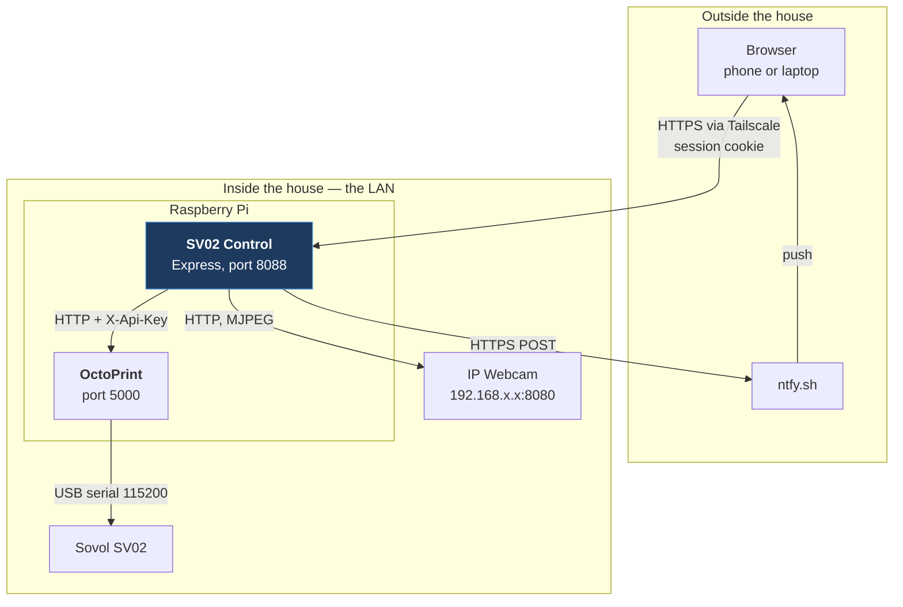
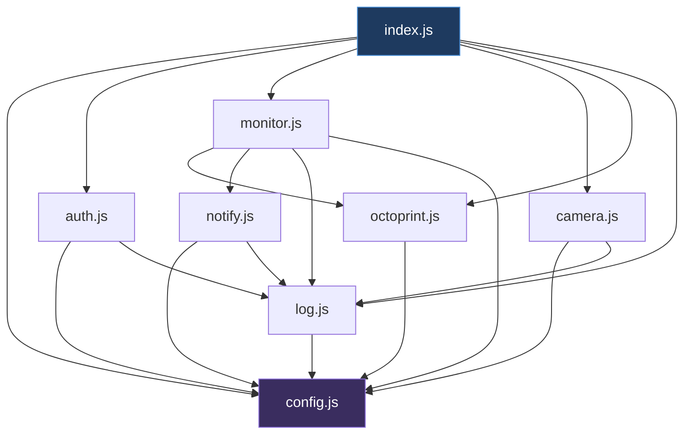
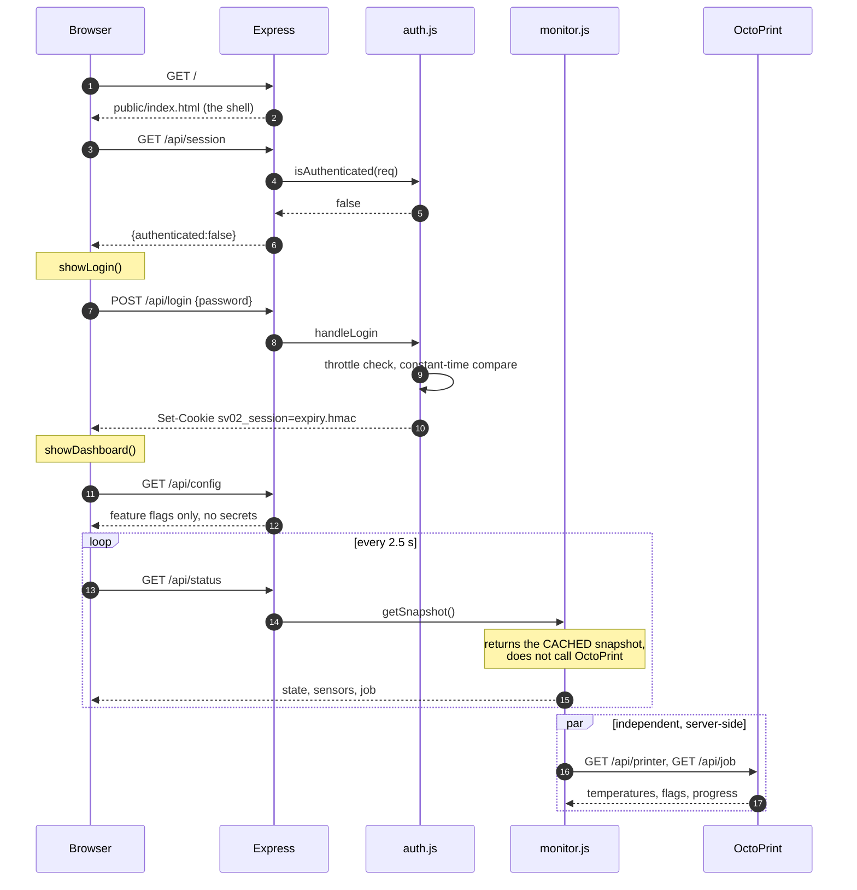
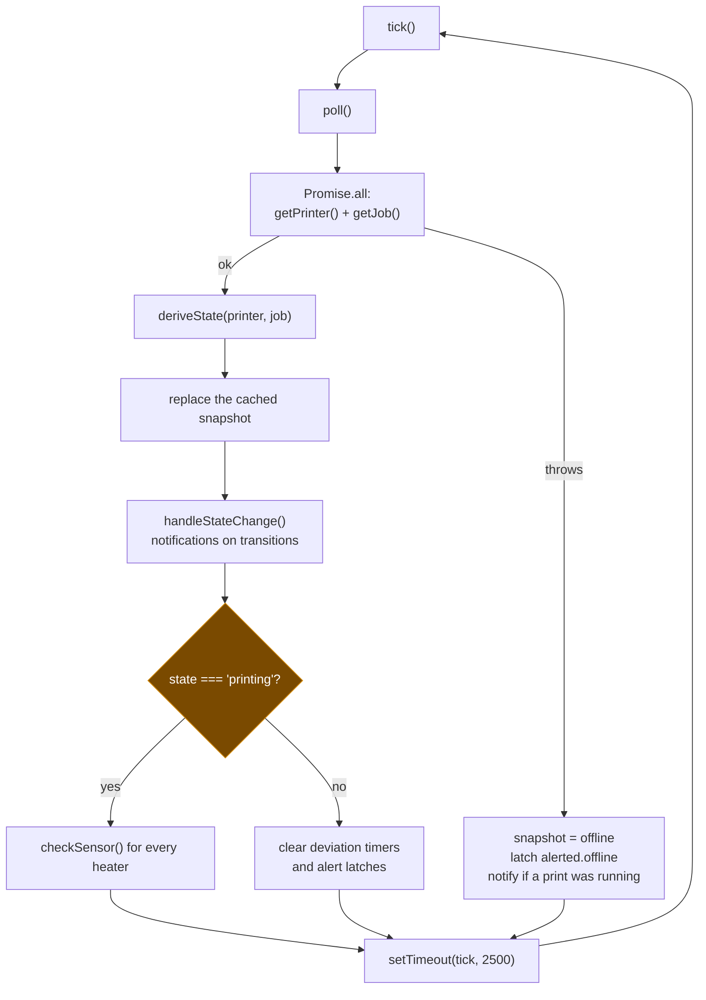
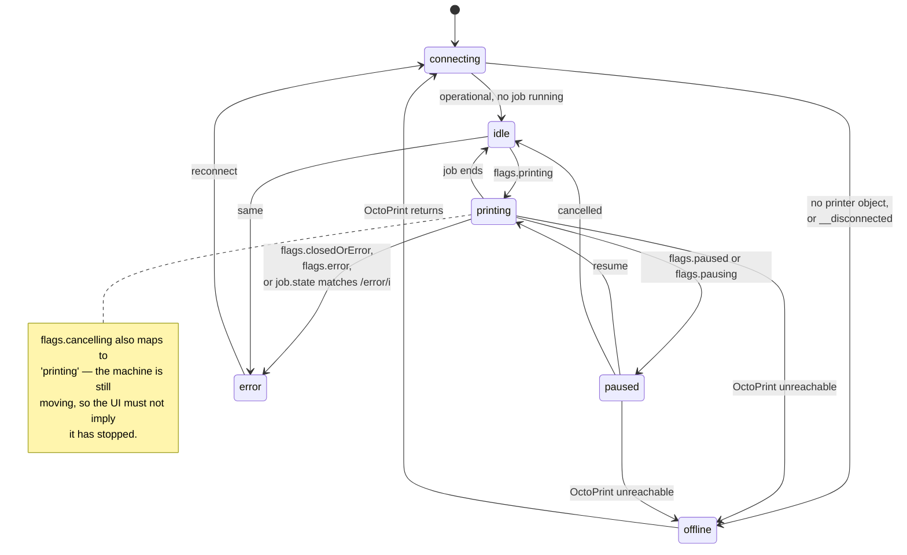
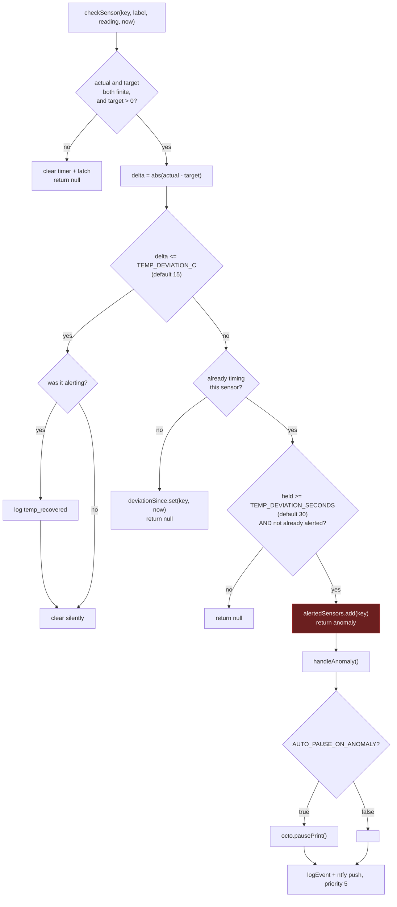
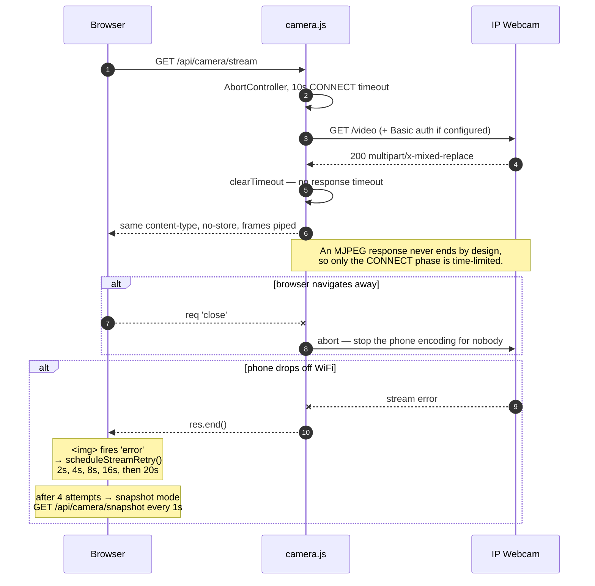
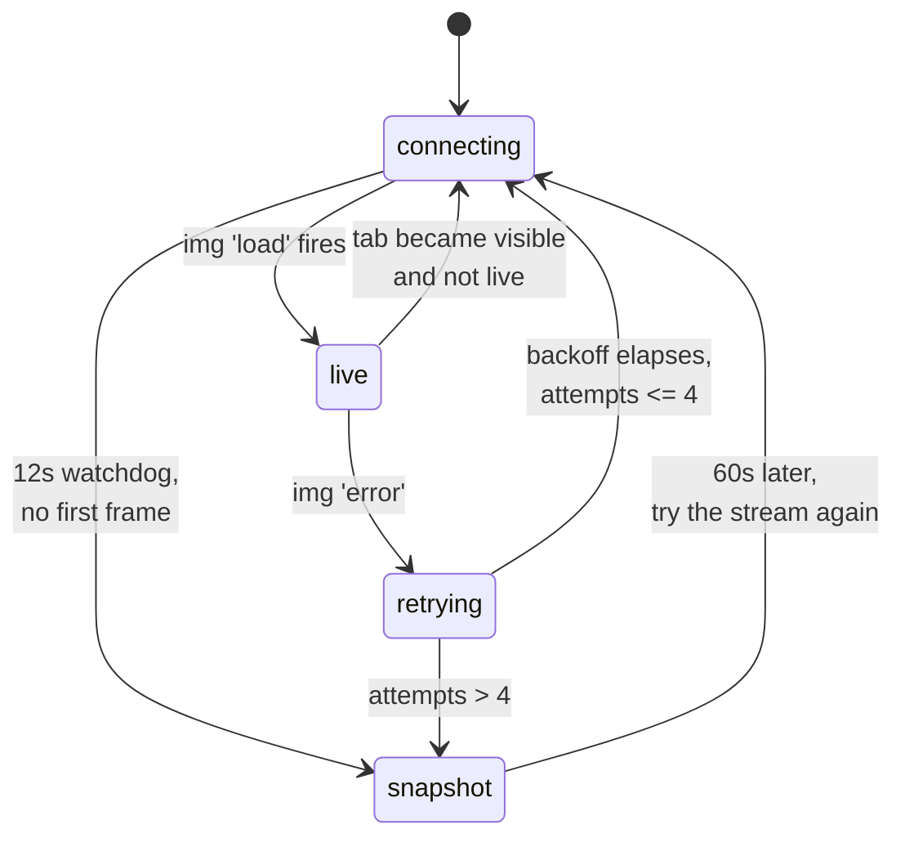

# 04 — Application architecture

**What this document is for:** to explain how the dashboard actually works, at
the level of detail you need to change it safely. Everything here is derived
from reading the code, not from the README's claims — where the two disagree,
the code is documented and the discrepancy is noted at the end.

The application lives in [`sv02-control/`](../sv02-control/). It is ~2,400
lines of ES-module JavaScript with two runtime dependencies (`express`,
`multer`) and no frontend build step.

## Contents

- [System context](#system-context)
- [Module map](#module-map)
- [The request lifecycle](#the-request-lifecycle)
- [The API surface](#the-api-surface)
- [The poll loop](#the-poll-loop)
- [State derivation](#state-derivation)
- [Anomaly detection](#anomaly-detection)
- [Notifications](#notifications)
- [The camera relay](#the-camera-relay)
- [Security model](#security-model)
- [The frontend](#the-frontend)
- [Data and persistence](#data-and-persistence)
- [Configuration](#configuration)
- [Test strategy](#test-strategy)
- [The demo build](#the-demo-build)
- [Extension points](#extension-points)
- [Deliberate trade-offs](#deliberate-trade-offs)
- [Observations and documentation drift](#observations-and-documentation-drift)

---

## System context



Three structural facts follow from this picture, and all of the design does:

**1. The app never touches the printer.** There is no serial code anywhere in
this repository. Every printer interaction is an HTTP call to OctoPrint, and
OctoPrint owns the serial protocol. If OctoPrint is down, the correct behaviour
is to report that clearly — which is what the `offline` state is for.

**2. The camera must be relayed server-side.** The phone's `192.168.x.x`
address is meaningless outside the LAN. A browser in a café cannot fetch it.
The Pi *is* on the LAN, so the Pi fetches the stream and pipes it through the
connection the browser already has. This also keeps the phone's address and any
camera credentials out of the browser entirely.

**3. The API key lives on one side of a wall.** It is attached in exactly one
place — `octoFetch()` in `server/octoprint.js:60` — and there is no route that
returns it. A test asserts this (`the API key is never exposed to the client`,
`test/run.mjs:180`).

## Module map

| File | Lines | Responsibility | Key exports |
|---|---|---|---|
| [`server/index.js`](../sv02-control/server/index.js) | 334 | Express app: boot checks, all routes, upload handling, static serving, error handling, signal handling | — (entry point) |
| [`server/config.js`](../sv02-control/server/config.js) | 136 | `.env` loading, typed accessors, camera-URL normalisation, fatal-vs-warning validation | `config`, `validateConfig`, `warnings`, `normaliseCameraUrl`, `ROOT` |
| [`server/octoprint.js`](../sv02-control/server/octoprint.js) | 229 | The OctoPrint REST client. Every printer verb, the error taxonomy, and state derivation | `octoFetch`, `OctoPrintError`, `getPrinter`, `getJob`, `pausePrint`, `resumePrint`, `cancelPrint`, `sendCommand`, `connectPrinter`, `setToolTemp`, `setBedTemp`, `listFiles`, `selectFile`, `deleteFile`, `uploadFile`, `deriveState` |
| [`server/monitor.js`](../sv02-control/server/monitor.js) | 324 | The single background poll loop, sensor discovery, anomaly detection, state-transition notifications, the cached snapshot | `startMonitor`, `stopMonitor`, `getSnapshot` |
| [`server/camera.js`](../sv02-control/server/camera.js) | 120 | MJPEG stream relay and single-frame snapshot relay | `proxyStream`, `proxySnapshot` |
| [`server/auth.js`](../sv02-control/server/auth.js) | 142 | Stateless HMAC session cookie, constant-time password check, per-IP login throttle | `handleLogin`, `handleLogout`, `requireAuth`, `isAuthenticated` |
| [`server/notify.js`](../sv02-control/server/notify.js) | 82 | ntfy push, fire-and-forget | `push`, `notifyPrintStarted`, `notifyPrintDone`, `notifyPrintFailed`, `notifyAnomaly`, `notifyPrinterOffline` |
| [`server/log.js`](../sv02-control/server/log.js) | 79 | Rotating NDJSON event log plus an in-memory ring of 200 | `logEvent`, `recentEvents`, `readEventsFromDisk` |

Dependency direction is strictly downward — nothing imports `index.js`:



`config.js` is the only leaf, and it loads `.env` as a side effect of being
imported — which is why importing it first in `scripts/check.mjs` is enough to
give that script the full configuration.

## The request lifecycle



The key thing in that diagram: **`GET /api/status` never calls OctoPrint.** It
returns a snapshot the background loop already fetched. The browser's poll rate
and the OctoPrint poll rate are decoupled, and N browsers cost nothing extra.

### The auth boundary

`server/index.js:76` is the wall:

```js
app.use('/api', requireAuth);
```

Everything registered **before** that line is public; everything **after** it
requires a valid session cookie.

| Route | Public? | Why |
|---|---|---|
| `POST /api/login` | Yes | You cannot authenticate to authenticate. |
| `POST /api/logout` | Yes | Must work even with an expired cookie. |
| `GET /api/session` | Yes | The shell asks this before it knows anything. |
| `GET /api/health` | Yes | For uptime checks and the Docker `HEALTHCHECK`. Returns only printer state and a timestamp. |
| everything else | **No** | Including the camera — `the camera requires authentication` is an explicit test. |

### Route ordering

Three handlers are registered at the end, and their order matters:

1. `express.static(public/)` — serves `index.html`, `app.js`, `styles.css`.
2. `app.get('*')` — the SPA fallback. It calls `next()` for anything starting
   with `/api/`, so API paths fall through rather than being answered with HTML.
3. `app.use('/api', …)` — a JSON 404 for unknown API endpoints.
4. The four-arity error handler.

Get this order wrong and an unknown API route returns the HTML shell with a
200, which is maddening to debug from a browser.

## The API surface

| Method | Path | Auth | Purpose |
|---|---|---|---|
| `POST` | `/api/login` | — | Password → session cookie |
| `POST` | `/api/logout` | — | Clear the cookie |
| `GET` | `/api/session` | — | `{authenticated: boolean}` |
| `GET` | `/api/health` | — | Liveness; state + timestamp only |
| `GET` | `/api/status` | ✓ | The cached snapshot — the main data feed |
| `GET` | `/api/config` | ✓ | Feature flags and thresholds. **Deliberately narrow**: no key, no camera address, no credential |
| `GET` | `/api/events` | ✓ | Recent log entries, `limit` capped at 200 |
| `GET` | `/api/camera/stream` | ✓ | Relayed MJPEG |
| `GET` | `/api/camera/snapshot` | ✓ | Relayed single JPEG |
| `POST` | `/api/control/pause` | ✓ | `{action:'pause'\|'resume'}` |
| `POST` | `/api/control/cancel` | ✓ | Cancel the job |
| `POST` | `/api/control/emergency-stop` | ✓ | `M112`; replies `{reconnect:true}` |
| `POST` | `/api/control/reconnect` | ✓ | Re-establish the serial link after `M112` |
| `POST` | `/api/control/temperature` | ✓ | `{target:'bed'\|'tool<n>', value}` |
| `GET` | `/api/control/commands` | ✓ | The maintenance allowlist, for building the UI |
| `POST` | `/api/control/command` | ✓ | Run one allowlisted command by `id` |
| `GET` | `/api/files` | ✓ | G-code stored on OctoPrint, newest first |
| `POST` | `/api/files/print` | ✓ | Select and print a stored file |
| `DELETE` | `/api/files` | ✓ | Delete a stored file |
| `POST` | `/api/upload` | ✓ | Multipart upload, optionally start printing |

### Error handling

Every async route is wrapped in `route()` (`server/index.js:57`), which turns a
rejected promise into `next(err)` rather than an unhandled rejection. The
central error handler then translates:

| Condition | HTTP | Body |
|---|---|---|
| `OctoPrintError` with `offline: true` | `503` | `{error, printerOffline: true}` |
| `OctoPrintError` with a status | that status, else `502` | `{error, printerOffline: false}` |
| Anything else | `500` | `{error: 'Something went wrong on the server.'}` |

The generic 500 message is deliberate: internal error text is logged, not
returned. Everything the user sees is either a real OctoPrint message or a
message written for them.

## The poll loop

One `setTimeout` chain in `server/monitor.js`, started once from the `listen`
callback. Not `setInterval` — a chained timeout cannot overlap with itself if
OctoPrint is slow.



`getSnapshot()` reshapes the raw OctoPrint payload into exactly what the
frontend needs — the browser never sees OctoPrint's own JSON:

```js
{
  state: 'printing',                    // see State derivation
  error: null,                          // last transport error, if offline
  updatedAt: '2026-08-28T21:29:22.232Z',
  offlineReason: null,                  // why, in words
  sensors: [                            // one per heater REPORTED, not assumed
    { key: 'tool0', label: 'Nozzle 1', kind: 'tool',
      actual: 209.8, target: 210, max: 260,
      deviatingSince: null,             // ISO timestamp while being timed
      alerting: false },                // true once the alert has fired
    // … tool1 (independent hotends only), bed
  ],
  toolhead: { extruders: 2, sharedNozzle: true },   // from the printer profile
  job: {
    file: 'benchy_v3.gcode',
    completion: 42.7,
    printTime: 2310, printTimeLeft: 3090,
    printTimeText: '38m 30s', printTimeLeftText: '51m 30s',
    estimatedTotal: 5400
  },
  anomalyWatch: { thresholdC: 15, holdSeconds: 30, autoPause: false }
}
```

`max` is server-supplied (260 for a tool, 120 for the bed) so the frontend's
slider bounds and the server's validation cannot drift apart.

## State derivation

`deriveState(printer, job)` at `server/octoprint.js:203` collapses OctoPrint's
several state sources into one label. Order matters — the checks are a
priority list, not independent tests.



| Input | Result |
|---|---|
| `printer` null, or `printer.__disconnected` | `offline` |
| `flags.closedOrError` or `flags.error` | `error` |
| `flags.printing` | `printing` |
| `flags.paused` or `flags.pausing` | `paused` |
| `flags.cancelling` | `printing` |
| not `flags.operational` | `connecting` |
| `job.state` matches `/error/i` | `error` |
| otherwise | `idle` |

**The subtle one:** OctoPrint returns **HTTP 409** from `/api/printer` when the
printer is disconnected from the serial port. That is not a failure of this
app — it is the normal "printer is off" answer. `getPrinter()` catches it and
returns `{__disconnected: true, reason: …}` rather than throwing
(`server/octoprint.js:110`). Everywhere else a 409 means "the printer is not in
a state that allows that command", and *is* surfaced as an error.

## Anomaly detection

The safety net. Runs only while `state === 'printing'`, once per heater, on
every poll.



Four design points worth understanding before you change the thresholds:

**`target <= 0` is skipped entirely.** A heater that is off has no meaningful
deviation. Without this rule, a nozzle cooling from 210 °C after a print would
fire an alarm continuously.

**Two separate collections do two separate jobs.** `deviationSince` records
*when* a sensor first went out of range — that is the stopwatch. `alertedSensors`
records that an alert has already fired — that is the latch that stops one
fault producing an alert every 2.5 seconds. The frontend uses both: a card is
highlighted while the stopwatch runs, and escalates once the latch is set.

**Recovery is explicit.** Coming back within tolerance logs `temp_recovered`
and clears both, so a *second*, later fault on the same sensor can alert again.

**Sensors are discovered, never assumed.** `listSensors()` filters the reported
temperature keys with `/^(tool\d+|bed)$/` and sorts tools before the bed,
numerically. Labels adapt: one hotend is `Nozzle`, two become `Nozzle 1` and
`Nozzle 2`.

**A shared nozzle is one heater.** The SV02 is 2-in-1-out: two drives, one
nozzle, one thermistor (`M115` reports `EXTRUDER_COUNT:1`). OctoPrint models
that as two extruders with `sharedNozzle`, and reports the single heater under
both `tool0` and `tool1`. `getToolhead()` reads the printer profile — again
every `PROFILE_REFRESH_MS` (default 60 s) and straight after a reconnect — and
`listSensors()` then keeps only `tool0`. Otherwise one heater would render twice
and a single fault would raise two alerts. Drives and heaters stay separate:
`snapshot.toolhead.extruders` still builds the extrusion picker, and extruding
on any drive checks the shared heater's temperature.

## Notifications

Fired from state transitions in `handleStateChange()`, and from
`handleAnomaly()`. All pushes are fire-and-forget with a 6-second timeout: a
notification failure must never break a control action or stall the poll loop.

| From | To | Log event | Push | Priority |
|---|---|---|---|---|
| `null` (first poll) | anything | — | — | — |
| anything | `connecting` | — | — | — |
| not `paused` | `printing` | `print_started` | Print started | 3 |
| `paused` | `printing` | `print_resumed` | — | — |
| anything | `paused` | `print_paused` | — | — |
| anything | `error` | `printer_error` | Print failed | 5 |
| `printing`/`paused` | `offline` | `print_interrupted` | Printer unreachable | 5 |
| `printing`/`paused` | other, completion ≥ 99.5 % | `print_done` | Print complete | 4 |
| `printing`/`paused` | other, completion < 99.5 % | `print_stopped` | Print failed | 5 |
| — | — | `temp_anomaly` | Temperature anomaly / Print auto-paused | 5 |

Two of those rows exist because of specific bugs that are easy to reintroduce:

- **`paused → printing` is a resume, not a new print** — and crucially it must
  not fall through to the "left an active print" branch, which would report a
  healthy print as having stopped. There is a dedicated test for this:
  `resuming does not log the print as stopped` (`test/run.mjs:203`).
- **`connecting` is transient**, a step OctoPrint passes through. Announcing it
  would tell you a running print had ended.

The first poll after boot records the state without announcing it — otherwise
every restart would claim a print had just started.

## The camera relay



The **no response timeout** decision is the important one. An MJPEG stream is
an HTTP response that intentionally never completes; a conventional inactivity
timeout would kill a perfectly healthy feed. So the connect phase is bounded at
10 seconds and the stream itself is not bounded at all — liveness is judged by
the browser, which sees frames or does not.

`proxySnapshot()` is the simpler sibling: an 8-second timeout, buffer the whole
response, set `Cache-Control: no-store`, done. Its URL is derived automatically
from the stream URL by swapping the path to `/shot.jpg`, which is what the IP
Webcam app serves.

## Security model

### What protects what

| Mechanism | Where | Protects against |
|---|---|---|
| API key attached server-side only | `octoprint.js:60` | A compromised browser session exfiltrating the key |
| `/api/config` returns booleans, not values | `index.js:82` | Leaking the camera address, topic URL or thresholds' sources |
| Constant-time compare, both sides SHA-256'd first | `auth.js:16` | Timing attacks. Pre-hashing fixes the compared length, which `timingSafeEqual` would otherwise leak by throwing on a length mismatch |
| HMAC-signed stateless token `<expiryMs>.<hmac>` | `auth.js:29` | Cookie forgery. Length is checked before `timingSafeEqual` to avoid a throw |
| `httpOnly`, `sameSite: 'lax'`, `secure` when `TRUST_PROXY_HTTPS` | `auth.js:126` | XSS reading the cookie; CSRF; the cookie travelling in clear |
| 8 attempts per IP per 15 minutes, self-pruning | `auth.js:64–99` | Brute force against a form on a public tunnel |
| G-code **allowlist**, five fixed entries | `index.js:167` | Arbitrary G-code from a browser — 300 °C hotends, disabled thermal protection, nozzle through the bed |
| `blockedWhilePrinting` enforced server-side | `index.js:190` | A homing command mid-print driving the toolhead through the model |
| Upload filter `.gcode\|.gco\|.g`, `safeFilename()`, 250 MB, 1 file | `index.js:34–49` | Path traversal via filename, and filling the SD card |
| Temperature bounds: tool ≤ 260 °C, bed ≤ 120 °C | `index.js:150` | A typo setting the bed to 1200 °C |
| Refuse to boot on incomplete config | `index.js:19` | Serving a dashboard with no password, or one that cannot reach the printer |

`safeFilename()` is worth reading once: `path.basename()`, then replace
everything outside `[A-Za-z0-9._-]` with `_`, then strip leading dots, then
keep the **last** 100 characters. Taking the tail rather than the head keeps the
extension, which is what OctoPrint dispatches on.

### Stated limits

Being explicit about the boundary is more useful than a longer list of controls.

- **One shared password.** No user accounts, no roles, no audit trail per person.
- **The throttle is in memory** and resets when the service restarts. Adequate
  for a single-user tool; not a lockout system.
- **No CSRF token.** Mitigated by `SameSite=lax` plus every mutating route
  requiring `POST`/`DELETE` with a JSON content type. On a public URL this
  would deserve a second look; behind Tailscale it does not.
- **Sessions cannot be revoked individually.** Changing `SESSION_SECRET`
  invalidates all of them at once, which is the correct response to a lost
  device.
- **`ProtectHome=false`** in the systemd unit, because the app is normally
  installed under `/home/pi`. Tightening this means moving the install.

## The frontend

`public/app.js` is 897 lines in a single IIFE — no modules, no framework, no
build step. It is organised in labelled sections: helpers, camera, rendering,
polling, events, controls, maintenance, files, upload, auth, boot.

### The `api()` wrapper

Every request goes through one function (`app.js:91`), which is what makes
session expiry behave sanely:

```js
if (response.status === 401 && !path.startsWith('/api/login')) {
  showLogin();                      // bounce to login, everywhere, once
  throw new Error(data?.error || 'Your session expired. Sign in again.');
}
```

A 401 on `/api/login` is simply a wrong password and keeps its own message. A
401 anywhere else means the session went away. Getting this wrong produces
"Request failed (HTTP 401)" toasts on a dashboard that looks logged in.

### The camera state machine



Backoff is `min(2000 * 2^(n-1), 20000)` — 2 s, 4 s, 8 s, 16 s, then 20 s
forever, so a phone switched off overnight does not hammer the network. Each
attempt appends a cache-buster (`?t=Date.now()`), without which the browser may
reuse the dead connection and never reconnect.

Snapshot mode polls `/api/camera/snapshot` once a second through an off-screen
`Image` and only swaps `el.camera.src` on a successful `onload` — so a failed
fetch never blanks a good frame. Three consecutive failures escalate the
overlay message.

`visibilitychange` matters more than it looks: a backgrounded tab has its MJPEG
connection torn down by the browser, and without this handler you return to a
frozen frame that looks live.

### Rendering temperature cards

`renderSensors()` keeps a `signature` of the sensor keys and only rebuilds the
DOM when that set changes. On every other poll it updates values in place.

This is not premature optimisation — it is the difference between a usable
number input and an unusable one. Rebuilding the card every 2.5 seconds would
destroy focus and wipe a half-typed target temperature.

### Upload uses XHR, not fetch

`fetch()` still provides no upload progress events. A 200 MB G-code file over a
phone tunnel needs a progress bar, so `uploadFile()` uses `XMLHttpRequest` with
`xhr.upload.addEventListener('progress', …)`. This is the one place the
frontend deliberately uses the older API, and the comment in the source says so.

### Other frontend behaviours worth knowing

- **Three consecutive `/api/status` failures** raise the "no connection"
  banner, not one. A single blip on a mobile connection is normal.
- **Dismissed banners stay dismissed** via `state.dismissedBanners`, except the
  offline banner, which is un-dismissed when the printer comes back so a later
  outage shows again.
- **Destructive actions confirm** through a `<dialog>`: cancel, emergency stop,
  printing a stored file, and any maintenance command flagged
  `blockedWhilePrinting`.
- **`withBusy()`** disables a button, swaps its label, restores it in a
  `finally`, and always re-polls afterwards — so the UI reflects the result
  immediately rather than up to 2.5 seconds later.
- **Stray drops are swallowed** at `window` level, so dropping a file outside
  the dropzone does not navigate away from the app.

## Data and persistence

There is no database.

| Data | Where | Lifetime |
|---|---|---|
| The printer snapshot | A module-level variable in `monitor.js` | Until the next poll |
| Recent events | `recent[]`, capped at 200, newest first | Until restart |
| Event history | `data/events.log`, NDJSON, rotated at 2 MB keeping `.log.1` | Until rotated out |
| Uploaded G-code | Streamed straight through to OctoPrint; `data/uploads` is created but multer uses `memoryStorage()` | Not retained here |
| Sessions | Nowhere — the cookie is self-verifying | Until expiry (default 720 h) |
| Login attempts | A `Map` in `auth.js`, pruned every 15 min via an `unref()`'d interval | Until restart |

`GET /api/events` serves the in-memory ring, and falls back to reading the file
when the ring is empty — which is exactly the case immediately after a restart.
Corrupt lines are skipped rather than failing the whole read.

Logging never takes the server down: all disk errors are caught and reported to
stderr once.

## Configuration

`config.js` loads `.env` itself rather than relying on `--env-file`, so
`npm start` works unmodified on Node 18. Values already present in the real
environment win over the file.

Validation is split in two, and the split is the interesting part:

**Fatal** (`validateConfig()` — refuses to boot): missing or placeholder
`OCTOPRINT_API_KEY`, missing/placeholder/under-8-character `APP_PASSWORD`,
missing `OCTOPRINT_URL`.

**Warnings** (`warnings()` — logs and continues): no camera configured, no ntfy
topic, no `SESSION_SECRET`. Each of these degrades one feature; none of them
makes the app dishonest about the printer, so none of them stops it starting.

`normaliseCameraUrl()` exists because of what users actually do: the IP Webcam
app displays `http://192.168.1.50:8080`, so that is what people paste — but the
stream is at `/video`. A bare host gets `/video` appended; an explicit path is
left alone; an unparseable value is handed back untouched so the error surfaces
against what the user actually typed. Three tests cover this
(`test/run.mjs:140–153`).

## Test strategy

`npm test` runs `test/run.mjs`: **56 end-to-end tests, currently all passing**.
It spawns the real server as a child process on port 8099 against a mock
OctoPrint (`:5099`) and a mock camera (`:5098`). No printer, no network, no
mocking of the app's own internals — the tests drive real HTTP.

| Group | Tests | What it pins down |
|---|---|---|
| Authentication | 3 | Anonymous callers rejected; wrong password rejected; correct password issues a cookie |
| Camera URL handling | 3 | Bare host → `/video`; explicit path untouched; unparseable does not throw |
| Sensors and job | 4 | Every reported heater appears; two hotends labelled distinctly; durations formatted; **the API key never reaches the client** |
| Print controls | 5 | Pause; resume sent as a resume; **resuming not logged as stopped**; cancel; `M112` |
| Temperatures | 4 | Each hotend targeted individually; nozzle > 260 refused; bed > 120 refused; unknown heater refused |
| Maintenance allowlist | 3 | Only its own G-code runs; unknown id refused; homing refused mid-print |
| Stored files | 3 | Recursive listing including folders; newest first; print refused while printing |
| Upload | 3 | Non-G-code rejected; G-code reaches OctoPrint; second print refused |
| Camera relay | 3 | Snapshot is a real JPEG; MJPEG relays multiple frames; the camera requires auth |
| Failure detection | 3 | Sustained deviation raises an anomaly; it appears on the sensor; recovery clears it |
| OctoPrint downtime | 3 | Clean offline state, not a crash; controls fail cleanly; the server still serves |
| Motion and tuning | 13 | `G91`/`G90` wrapper; jog clamped; unknown axis refused; per-axis and full homing; cold extrusion refused; tool selected first; fan PWM and off; speed and flow clamped; babystep clamped; history recorded; motion refused mid-print; tuning allowed mid-print |
| Shared nozzle | 6 | Toolhead read from the profile; a shared nozzle is one heater; history records it once; drive 2 extrudes through it; a missing drive is refused; independent hotends restored |

The mock OctoPrint reports two independent hotends by default — `tool0` at
210 °C, `tool1` cold, `bed` at 60 °C, switchable to the SV02's real shared
nozzle with `setProfile()` — and records every request body so tests can assert on
what was actually sent. `SIGUSR2` toggles a thermal fault on `tool0`, which is
how the anomaly tests induce one.

**Not covered, deliberately:** the frontend (no browser in the loop), real
serial behaviour, Tailscale/tunnel behaviour, and systemd. Those are verified by
the runbook's manual gates instead.

## The demo build

`node demo/build.mjs` writes `demo/dist/`: a static, self-contained dashboard
that runs with no server and no printer.

The design principle is worth copying elsewhere: **`app.js` and `styles.css`
are copied verbatim** from `public/`. Only `index.html` is modified, to load
`demo/mock-backend.js` before the app boots. That file stubs `fetch` and
`XMLHttpRequest` and draws a simulated camera frame on a canvas. `app.js` has no
idea it is there — so the demo is genuinely the app, not a mock-up of it, and
it cannot drift.

The demo adds exactly one control that does not exist in the real app,
**Simulate a thermal fault**, because the failure detection is otherwise
invisible without an actual fault.

`demo/dist/` is git-ignored, and nothing in `demo/` is served by the real
server — the Pi serves `public/` only.

## Extension points

### Add a maintenance command

Edit `MAINTENANCE_COMMANDS` in `server/index.js:167`:

```js
preheatPLA: {
  gcode: ['M104 S200', 'M140 S60'],
  label: 'Preheat for PLA',
  blockedWhilePrinting: true,
},
```

That is the whole change. `GET /api/control/commands` serves the list and
`loadMaintenance()` builds a button for every entry, so the UI updates itself.
Restart the service.

⚠️ This is an allowlist by design ([D6](07-decision-log-and-future-work.md#d6--a-g-code-allowlist-not-a-pass-through)).
Do not be tempted to add a pass-through endpoint.

### Add a notification

Add a helper in `server/notify.js` following the existing pattern, then call it
from the appropriate branch of `handleStateChange()` or `handleAnomaly()` in
`server/monitor.js`. Keep it awaited-but-harmless: `push()` never throws.

### Add an API route

Register it **after** `app.use('/api', requireAuth)` unless it genuinely must
be public, wrap the handler in `route()`, and throw `OctoPrintError` (or let
`octoFetch` throw it) rather than writing your own status codes — the central
error handler already maps it correctly.

### Add a field to the dashboard

Extend the object returned by `getSnapshot()` in `server/monitor.js`, then read
it in `render()` in `public/app.js`. No build step: save and reload.

### Change the anomaly thresholds

`.env` only — `TEMP_DEVIATION_C`, `TEMP_DEVIATION_SECONDS`,
`AUTO_PAUSE_ON_ANOMALY`. No code change, and they are surfaced to the frontend
through `/api/config` and `snapshot.anomalyWatch`.

## Deliberate trade-offs

| Decision | Alternative rejected | Reason |
|---|---|---|
| Sit in front of OctoPrint | Drive the serial port directly | The serial protocol is a decade of firmware quirks. Reimplementing it would be the whole project, and worse. |
| Relay the camera server-side | Point `` at the phone | A LAN address is unreachable from outside — it would work at home and fail everywhere else, which is the worst failure mode. |
| One server-side poll loop | Poll per browser tab | N tabs cost one request; and **anomaly detection keeps running with no browser open**. |
| No frontend build step | React/Vue + bundler | A toolchain on a Pi 3B is slow to install and breaks across Node upgrades. Nothing here needs a framework. |
| NDJSON log file | SQLite / `better-sqlite3` | Native compilation on a Pi is slow and breaks on Node upgrades. A text file is `cat`-able, `grep`-able and `jq`-able. |
| G-code allowlist | A terminal in the UI | This is reachable from the internet behind one password. Five known-safe commands is a far smaller blast radius. |
| Stateless HMAC sessions | A session store | Editing `.env` requires a restart; a store would log you out every time. |
| Discover heaters; read the toolhead from the profile | Hardcode the SV02's layout | Costs nothing — and the hardcoded guess (two hotends) turned out to be wrong. Independent hotends and a shared nozzle both fall out of the general case. |
| Chained `setTimeout` | `setInterval` | A chained timeout cannot overlap itself when OctoPrint is slow. |
| Refuse to boot on bad config | Start and fail later | A clear message at startup beats a confusing failure at 2 a.m. |

## Observations and documentation drift

Noted while reading the code. None of these are faults in the running app
unless marked otherwise.

1. **Fixed during this project.** `test/mocks/octoprint.mjs` and
   `test/mocks/camera.mjs` detected direct execution with
   ``import.meta.url === `file://${process.argv[1]}` ``. On Windows
   `process.argv[1]` is `E:\path\file.mjs`, so the comparison never matched and
   `node test/mocks/octoprint.mjs` exited 0 having done nothing — the documented
   no-hardware trial was impossible on Windows, and failed *silently*. Now
   `pathToFileURL(process.argv[1]).href`. Tests still 37/37.

2. **Stale repository URL, fixed.** `deploy/sv02-control.service` had
   `Documentation=https://github.com/Bharadhwajreddy/Printer`, and
   `SETUP-PROMPT.md` step 10 named the same repository. The actual repository is
   `SovolSmart`. Both updated.

3. **`DELETE /api/files` is broader than its message.** The guard at
   `server/index.js:229` is `if (snap.job?.file && (state is printing or
   paused))`, which refuses to delete *any* file while a print is running, not
   just the one being printed. The error text says "Cannot delete files while a
   print is running", so the message and the behaviour agree — but it is more
   conservative than a reader of the README might expect. Left as-is: deleting
   files mid-print is not a thing anyone needs to do.

4. **`startPrint()` is exported but unused.** `server/octoprint.js:126`.
   `selectFile(path, true)` covers the case. Harmless.

5. **`config.uploadDir` is created but never written to.** `index.js:26` calls
   `mkdirSync` on it, but multer uses `memoryStorage()` and the buffer goes
   straight to OctoPrint. An empty `data/uploads/` directory appears and stays
   empty. Harmless; removing it would be a tidy-up.

6. **README wording, minor.** The README says the app "polls OctoPrint every
   2.5s"; more precisely it waits 2.5 s *after each poll completes* (chained
   `setTimeout`), so the real interval is 2.5 s plus the round-trip. That is the
   safer behaviour and the wording is not misleading.

7. **`.env.example` shows `TRUST_PROXY_HTTPS=true`** as the default, which is
   right behind a tunnel but sets a `Secure` cookie — so a plain-HTTP test on
   the LAN will appear to log in and immediately bounce back to the login
   screen, because the browser refuses to store the cookie. The comment in the
   file explains this, but it is the single most likely "it will not let me log
   in" during first setup on the LAN. **Set it to `false` until the tunnel is
   up, then set it back to `true`.**

---

Next: **[05 — Operations & troubleshooting](05-operations-and-troubleshooting.md)** ·
**[07 — Decision log & future work](07-decision-log-and-future-work.md)**
