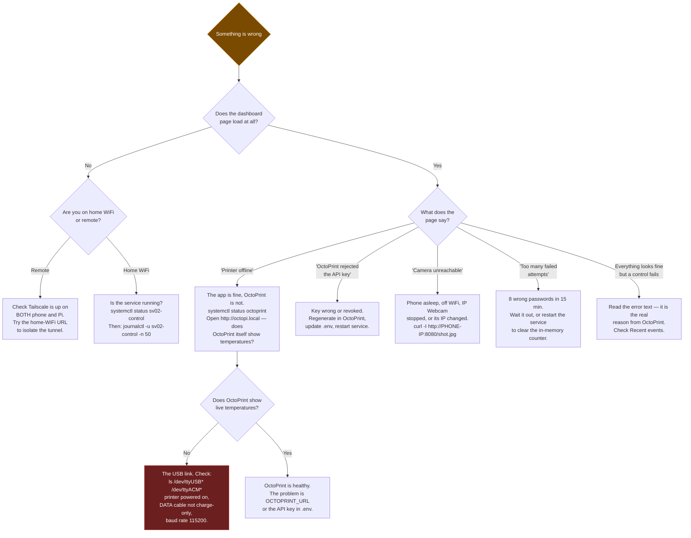

# 05 — Operations & troubleshooting

**What this document is for:** living with the thing once it is built. Daily
use, the maintenance that keeps it working, and a diagnostic path for every
failure it can show you. The build steps are in
[03 — Pi & OctoPrint runbook](03-pi-and-octoprint-runbook.md); this document
starts where that one ends.

## Contents

- [Daily use](#daily-use)
- [The golden rule of debugging](#the-golden-rule-of-debugging)
- [Diagnostic decision tree](#diagnostic-decision-tree)
- [Symptom index](#symptom-index)
- [Where the evidence lives](#where-the-evidence-lives)
- [Routine maintenance](#routine-maintenance)
- [Changing settings safely](#changing-settings-safely)
- [Command reference card](#command-reference-card)
- [Backup and recovery](#backup-and-recovery)
- [Safety](#safety)

---

## Daily use

### Starting a print from your phone

1. Slice on the laptop as usual, producing a `.gcode` file.
2. Open the dashboard, log in.
3. **Upload G-code** → choose the file → leave *Start printing immediately*
   ticked → **Upload**.
4. Watch the progress bar and the camera.

If it is something you print regularly, it is already on the printer: scroll to
**On the printer**, find it (newest first), press **Print**. No upload.

### Watching a print

The camera is the centrepiece and updates continuously. Below it:

- **Progress** — filename, percentage, elapsed and remaining.
- **Temperatures** — one card per heater, current against target. A card turns
  into an alert if it deviates past the threshold.
- **Recent events** — everything the server has logged, newest first.

You can close the tab. The server keeps polling and keeps watching for
anomalies whether or not a browser is open — that is the whole point of the
server-side poll loop.

### Watching without the camera

The **Layer view** module draws the file being printed: a 2D top-down view of
the current layer beside a 3D view of everything printed so far, with the
nozzle marked on both. It comes from the sliced file and OctoPrint's byte
position in it, so it keeps working when the camera phone is asleep, and it
stops when the print pauses.

Drag the slider to look at any layer; press **Follow print** to snap back to
the live one.

If it says *Reading the G-code…* for a while, that is the Pi downloading and
parsing the file — a big file takes a few seconds. Files over 25 MB are not
visualised; the print is unaffected.

### Stopping a print

| Button | What it does | When |
|---|---|---|
| **Pause** | Firmware pauses, heaters stay on, head parks | Normal interruption. Resume later. |
| **Cancel print** | Ends the job cleanly. Asks first. | The print is ruined but the machine is fine. |
| **Emergency stop** | Sends `M112`. ⚠️ Heaters and motors cut **instantly**, firmware halts. | Something is actively going wrong. |

**After an emergency stop the printer stays halted** until the serial link is
re-established or it is power-cycled. That is the firmware's behaviour, not a
bug. A **Reconnect printer** button appears; if that does not bring it back,
switch the printer off and on.

### Maintenance buttons

| Button | G-code | Blocked while printing |
|---|---|---|
| Home all axes | `G28` | Yes |
| Auto bed level | `G28`, `G29` | Yes |
| Save settings to EEPROM | `M500` | Yes |
| Release the motors | `M18` | Yes |
| Turn off all heaters | `M104 S0`, `M140 S0` | No |

**Auto bed level does nothing useful until a probe is fitted.** The button is
there and correct; `G29` on a machine with no probe is a no-op. Fitting the
official Sovol BLTouch kit makes it work with no change to this app. See
[nozzle-probe-research.md](../sv02-control/docs/nozzle-probe-research.md).

## The golden rule of debugging

> **Work backwards along the chain and fix the earliest broken link.**

```
Printer  →  USB cable  →  OctoPrint  →  API key  →  SV02 Control  →  tunnel  →  your phone
```

Fixing a later link before an earlier one never works, and it is the single
most common way people waste an evening. If OctoPrint itself is not showing
temperatures, nothing you do to the dashboard can matter.

**`npm run check` is the fastest way to find out where you actually are.** It
runs on the Pi, tests each link in order, and names both the cause and the fix
for anything that fails. Run it before forming a theory.

```bash
cd ~/sv02-control && npm run check
```

## Diagnostic decision tree



## Symptom index

### "Printer offline" on the dashboard

The app is running; it cannot reach OctoPrint. The banner shows the actual
reason — connection refused, hostname not found, timeout — and that reason is
the diagnosis.

```bash
sudo systemctl status octoprint      # is OctoPrint running?
curl -I http://localhost:5000        # does it answer?
grep OCTOPRINT_URL ~/sv02-control/.env
```

If OctoPrint is running but the *printer* is disconnected from it, you get the
same offline state with a different reason. Open OctoPrint and press
**Connect**.

### "OctoPrint rejected the API key"

The key is wrong or was revoked.

1. OctoPrint → **Settings → Application Keys → Generate**, name `sv02-control`.
2. `nano ~/sv02-control/.env`, replace `OCTOPRINT_API_KEY`.
3. `sudo systemctl restart sv02-control`.

### "Camera unreachable"

In order of likelihood:

1. **The phone's IP changed.** By far the most common. Fix it permanently with
   a DHCP reservation in the router.
2. The phone is asleep or the screen locked — enable *Keep screen awake*.
3. IP Webcam is not running, or Android killed it in the background.
4. The phone dropped off WiFi.

Test from the Pi, not from your laptop — the Pi is what does the fetching:

```bash
curl -I http://<phone-ip>:8080/shot.jpg
```

The app retries on its own (2s, 4s, 8s, 16s, then every 20s) and falls back to
still frames if the continuous stream will not hold, so it recovers by itself
once the phone is back. You do not need to restart anything.

### The password is right but it bounces straight back to the login screen

Almost always `TRUST_PROXY_HTTPS=true` while you are testing over plain HTTP on
the LAN. That setting marks the session cookie `Secure`, so the browser accepts
the login response and then **refuses to store the cookie** — the next request
looks unauthenticated and the app shows the login screen again. Nothing is
wrong with your password.

```
# In .env, while testing on the LAN over http://
TRUST_PROXY_HTTPS=false
```

Then `sudo systemctl restart sv02-control`. **Set it back to `true` once you
are reaching the dashboard through Tailscale or a tunnel over HTTPS** — that is
what stops the cookie ever travelling in clear text.

### "Too many failed attempts"

Eight wrong passwords from one address locks that address out for 15 minutes.
The counter is in memory, so `sudo systemctl restart sv02-control` clears it
immediately.

### The dashboard logs you out after every restart

`SESSION_SECRET` is blank in `.env`, so a new random one is generated at each
startup and old cookies stop verifying. Generate one and set it:

```bash
node -e "console.log(require('crypto').randomBytes(32).toString('hex'))"
```

### Upload fails on a large file

The cap is 250 MB. Over a slow tunnel a large upload genuinely takes a while —
the progress bar reflects real progress, so let it finish. If it fails
immediately, check the extension: only `.gcode`, `.gco` and `.g` are accepted.

### A temperature alert fired but the print looks fine

The defaults are deliberately sensitive: 15 °C of deviation held for 30
seconds. A part-cooling fan blasting the nozzle on a bridge, or a draught from
an open window, can trip it. Widen the window in `.env` if it cries wolf:

```
TEMP_DEVIATION_C=20
TEMP_DEVIATION_SECONDS=60
```

Then `sudo systemctl restart sv02-control`. Do not widen it so far that a real
heater failure goes unnoticed — a failed thermistor or a heater that has fallen
out of the block moves far more than 20 °C.

### Notifications stopped arriving

```bash
cd ~/sv02-control && npm run check     # sends a real test notification
```

If check passes and your phone stays silent, the problem is on the phone:
ntfy's battery optimisation, or the subscription pointing at a different topic.
Confirm the topic name in the app matches `NTFY_TOPIC_URL` exactly.

### The service will not start

```bash
sudo systemctl status sv02-control
journalctl -u sv02-control -n 50 --no-pager
```

The app refuses to boot on incomplete configuration rather than starting
half-broken, and it prints exactly which setting is missing. The usual causes
are a missing `OCTOPRINT_API_KEY`, an `APP_PASSWORD` under 8 characters, or a
`WorkingDirectory=` in the service file that does not match where the app
actually is.

### The Pi disappeared from the network

```powershell
# On the Windows laptop
ping octopi.local
arp -a | findstr "b8-27-eb dc-a6-32 e4-5f-01"   # common Raspberry Pi MAC prefixes
```

If `octopi.local` does not resolve but the IP works, that is mDNS, not the Pi —
use the IP, and set a DHCP reservation so it stops moving.

## Where the evidence lives

| Source | Command | What it tells you |
|---|---|---|
| App service logs | `journalctl -u sv02-control -f` | Everything the app is doing, live |
| App event log | `cat ~/sv02-control/data/events.log` | Structured NDJSON: prints, anomalies, logins, errors |
| Recent events in the UI | The **Recent events** card | The same log, newest first, no SSH needed |
| OctoPrint service | `sudo systemctl status octoprint` | Whether OctoPrint itself is alive |
| OctoPrint's own logs | OctoPrint → Settings → Logs | Serial-level detail, the printer's own replies |
| Serial devices | `ls -l /dev/ttyUSB* /dev/ttyACM*` | Whether the printer is electrically present |
| Kernel USB events | `dmesg \| grep -i tty` | Whether the Pi *saw* the printer plug in |

The event log is newline-delimited JSON, so it is greppable and `jq`-able:

```bash
grep temp_anomaly ~/sv02-control/data/events.log
jq -r 'select(.level=="error") | "\(.ts) \(.message)"' ~/sv02-control/data/events.log
```

It rotates at 2 MB, keeping one previous file as `events.log.1`.

## Routine maintenance

| How often | Task |
|---|---|
| Every print | Glance at the first layer on the camera. Most failures are decided in the first two minutes. |
| Weekly | Check the camera phone is still charging and still streaming. |
| Monthly | `sudo apt update && sudo apt upgrade` on the Pi. Check `data/events.log` is rotating and not filling the card. |
| Every few months | Test the emergency stop deliberately, so you know it works before you need it. Confirm the systemd service still survives a reboot. |
| Whenever the router is replaced | Re-do **both** DHCP reservations — the phone's and the Pi's. |
| ⚠️ Always | A working smoke alarm in the room. |

## Changing settings safely

All settings live in one file on the Pi: `~/sv02-control/.env`. The full
reference is in [`.env.example`](../sv02-control/.env.example) and in the app's
[README](../sv02-control/README.md#configuration-reference).

```bash
nano ~/sv02-control/.env
sudo systemctl restart sv02-control
systemctl status sv02-control          # confirm it came back
```

**The app does not reload `.env` while running.** A restart is required, and
it is instant.

⚠️ **`.env` contains your OctoPrint API key and your dashboard password.** It
is git-ignored and must stay that way. Never paste its contents into a chat, an
issue, or a screenshot.

## Command reference card

Run these on the Pi over SSH.

```bash
# --- Is it alive? ---------------------------------------------------------
systemctl status sv02-control          # the dashboard app
systemctl status octoprint             # OctoPrint

# --- What is it doing? ----------------------------------------------------
journalctl -u sv02-control -f          # live logs, ctrl+c to stop
journalctl -u sv02-control -n 100      # last 100 lines
tail -f ~/sv02-control/data/events.log # structured event log

# --- Diagnose ------------------------------------------------------------
cd ~/sv02-control && npm run check     # tests every link in the chain
ls -l /dev/ttyUSB* /dev/ttyACM*        # is the printer electrically there?
dmesg | grep -i tty                    # did the Pi see it plug in?
curl -I http://localhost:5000          # is OctoPrint answering?
curl -I http://<phone-ip>:8080/shot.jpg  # is the camera answering?

# --- Fix -----------------------------------------------------------------
sudo systemctl restart sv02-control    # after editing .env
sudo systemctl restart octoprint       # if OctoPrint is stuck
sudo reboot                            # the honest last resort

# --- Where am I? ---------------------------------------------------------
hostname -I                            # the Pi's LAN address
tailscale ip -4                        # the Pi's Tailscale address
uname -m                               # armv7l = 32-bit, so Node 20
node --version                         # must be v18 or newer
```

On the Windows laptop:

```powershell
ssh <user>@octopi.local                          # log in
scp -r .\sv02-control <user>@octopi.local:~/     # copy the app over
ping octopi.local                                # is it there?
```

## Backup and recovery

**What is worth backing up:** almost nothing, and that is by design.

| Thing | Backed up how |
|---|---|
| The app's code | This git repository — already safe |
| The documentation | This git repository |
| `.env` | **Not backed up, on purpose.** It holds secrets. Keep the values in a password manager instead; recreating the file takes two minutes. |
| Printer G-code files | They live in OctoPrint and are re-sliceable from the models |
| Event log | Diagnostic history only. Losing it costs nothing. |
| The OctoPi SD card | Not worth imaging. Re-flashing and re-running the runbook is faster and gives you a clean system. |

**Full recovery from a dead SD card** is: re-flash OctoPi, re-run
[03 — Pi & OctoPrint runbook](03-pi-and-octoprint-runbook.md), `git clone` this
repository, recreate `.env` from your password manager. An hour, most of it
waiting.

## Safety

Read this once, properly.

⚠️ **`M112` (emergency stop)** cuts heaters and motors instantly and halts the
firmware. The printer then needs a reconnect or a power cycle. That is correct
behaviour and it is why the button asks for confirmation.

⚠️ **This app watches temperatures. It is not a fire safety device.** It reads
what the printer's own firmware reports. It cannot detect a thermal runaway
that the firmware itself misses — for example a thermistor that has fallen out
of the heater block, which reads *cold* while the block glows. And it can do
nothing whatsoever if the WiFi is down or the Pi has crashed.

⚠️ **Do not run prints unattended in a house you are not in without a smoke
alarm in the room with the printer.** Remote monitoring makes it *tempting* to
leave prints running while you are out. That temptation is the actual risk this
project introduces, and it is worth naming.

---

Next: **[06 — Firmware & hardware](06-firmware-and-hardware.md)** ·
**[07 — Decision log & future work](07-decision-log-and-future-work.md)**
