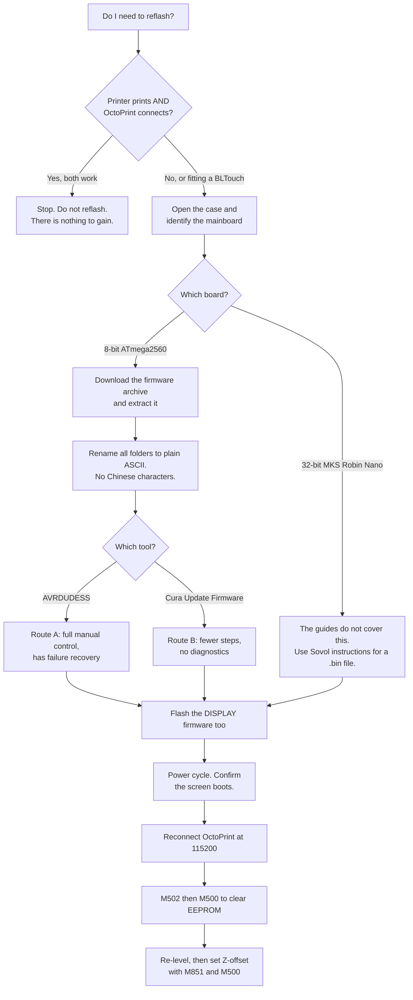
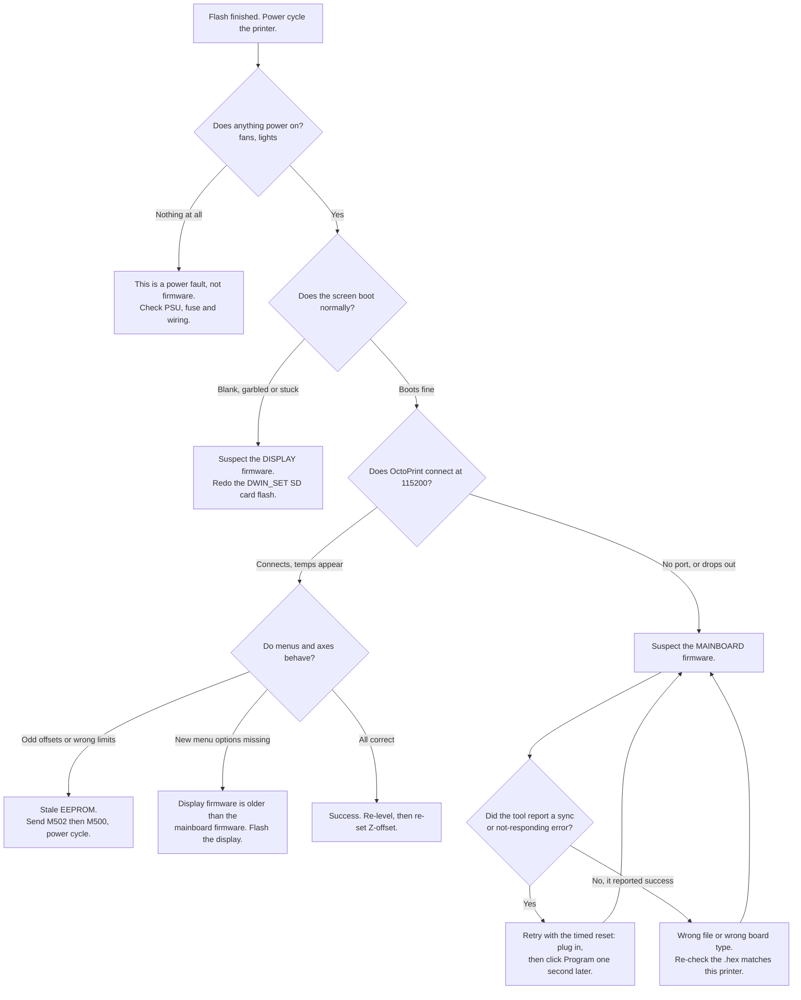

# 06 — Firmware and Hardware

**What this document is for.** This is the reference for the Sovol SV02's
hardware and its firmware, written for the person running this project's
dashboard rather than for a firmware developer. It covers what is physically
in the printer, exactly how the two flashing guides in `reference/` say to
reflash it (mainboard *and* the separate touchscreen), what to do when a flash
goes wrong, and — most importantly — which of the dashboard's features depend
on firmware and which do not. The short version, if you read nothing else: **if
the printer prints and OctoPrint connects, do not reflash anything.** Flashing
is something you do to gain a capability (a BLTouch probe) or to fix a
specific bug, never as routine maintenance.

---

## Contents

1. [Read this first: a conflict in the sources](#read-this-first-a-conflict-in-the-sources)
2. [Hardware inventory](#hardware-inventory)
3. [Which mainboard do I actually have?](#which-mainboard-do-i-actually-have)
4. [The firmware files](#the-firmware-files)
5. [Flashing the mainboard](#flashing-the-mainboard)
6. [Where the two guides disagree](#where-the-two-guides-disagree)
7. [Flashing the display (separate, and not optional)](#flashing-the-display-separate-and-not-optional)
8. [Danger and recovery](#danger-and-recovery)
9. [How firmware interacts with this project](#how-firmware-interacts-with-this-project)
10. [Should I reflash at all?](#should-i-reflash-at-all)
11. [Sources](#sources)

---

## Read this first: a conflict in the sources

There is a genuine contradiction between what this repository says the printer
is and what the two flashing guides describe, and it changes the entire
flashing procedure. It has to be resolved before anyone touches firmware.

| Source | What it says the board is | Implied flashing method |
| --- | --- | --- |
| This repo (`nozzle-probe-research.md`, `reference/firsttimesetup-superseded.md`) | **MKS Robin Nano**, 32-bit | Copy a `.bin` file to an SD card, power-cycle |
| `sv02-firmware-installation-guide.pdf` | **ATmega2560** (8-bit); the author states the board "happens to be a Creality V2.2.1 or V2.2" | Flash a `.hex` file over USB with AVRDUDESS |
| `sovol-sv02-firmware-flashing-olaf-teiser.pdf` | Not stated, but the firmware files shown are `.hex` | Cura → Update Firmware → Import a `.hex` |

`.hex` files are an 8-bit AVR convention. The MKS Robin Nano is a 32-bit STM32
board and is flashed with a `.bin` file placed on an SD card. **Both PDFs show
`.hex` files, so both PDFs describe an 8-bit SV02, not a Robin Nano one.**

Sovol shipped the SV02 with more than one mainboard over its production life,
so both statements can be true of *an* SV02 — but only one is true of *yours*.
Do not follow either PDF until you have looked inside the case and confirmed
what is actually fitted. [How to check is below.](#which-mainboard-do-i-actually-have)

> **Neither guide covers flashing an MKS Robin Nano.** If that is what you
> have, the mainboard procedure in Section 5 does not apply to your printer,
> and you will need Sovol's own instructions for that board. The **display**
> section, however, applies either way — the DWIN touchscreen is the same part
> and is flashed the same way regardless of which mainboard is behind it.

---

## Hardware inventory

Marked **[verified]** where a source read for this document states it, and
**[general]** where it is background knowledge the guides do not confirm.

| Part | What it is | Confidence |
| --- | --- | --- |
| Mainboard | **Disputed** — MKS Robin Nano (32-bit) per this repo; ATmega2560 / "Creality V2.2.1 or V2.2" per the installation guide PDF | Conflicting, see above |
| MCU | Follows from the board: STM32 if Robin Nano, ATmega2560 if the 8-bit board | Conflicting |
| Extruders | **Dual extruder**, described in the firmware filenames as a *mixing* / *Mixcolor* extruder kit | [verified] — repo and PDF filenames both say so |
| Hotend arrangement | Two filament inputs feeding the mixing hotend assembly; the repo describes the carriage as "two hotends side by side" | [verified] repo; the PDFs say nothing about hotend geometry |
| Display | **DWIN touchscreen** with its **own processor, own firmware, and its own microSD card slot on the display PCB** | [verified] — the Olaf guide's whole procedure depends on this |
| Stock firmware | **Marlin 2.0** from Sovol. Filenames seen: `SV02_Marlin_2.0.0_Mixing_V1.1.hex`, `SV02_Marlin_2.0.0_Mixing_BL_V1.1.hex`, and elsewhere `SV02_Marlin_2.0.0_V1.2.hex` | [verified] from PDF screenshots |
| Stock bed levelling | **Manual**, four knobs. No probe fitted from the factory | [verified] repo |
| Probe support | A **BLTouch variant of the firmware exists and ships in the same download** (the `_BL_` file) — so the firmware supports a probe, the hardware just does not have one | [verified] from PDF screenshot |
| Serial baud | 115200 | [general] and used throughout this project; the installation guide's 115200 is the *AVRDUDESS programmer* baud, a different setting that happens to share the number |

Two things worth pulling out of that table:

- **Sovol ships a BLTouch build alongside the plain build.** You are not
  compiling Marlin. Fitting a probe is "use the firmware file with `_BL_` in
  the name", which is a much smaller job than it sounds.
- **The display is a separate computer.** It is not a dumb panel driven by the
  mainboard. This is the SV02 gotcha that catches people out, and it gets
  [its own section](#flashing-the-display-separate-and-not-optional).

### What the guides do *not* cover

Worth naming the gaps, because they are the things people assume are
documented and then improvise:

- Bed size, thermistor types, stepper drivers, or any motion configuration.
- Anything about the MKS Robin Nano or `.bin` files.
- The EEPROM. Neither guide mentions `M500`, `M502`, or that settings survive
  a flash. (This matters — see [Danger and recovery](#danger-and-recovery).)
- Setting a Z-offset, or any post-flash calibration at all.
- OctoPrint, USB serial, or the baud rate used for printing. The only "115200"
  in either guide is an AVRDUDESS programmer setting.

---

## Which mainboard do I actually have?

Do this before anything else. It costs ten minutes and it is the difference
between a successful flash and a bricked board.

1. **Power the printer off and unplug it from the wall.** Not just the switch.
2. Open the electronics bay (underneath or on the side of the base, depending
   on the SV02 revision) and look at the largest circuit board.
3. Read the text printed on the board itself. You are looking for either
   `MKS Robin Nano` (usually with a version, e.g. `V1.2`) or a Creality-style
   `v2.2` / `v2.2.1` marking.
4. Photograph it before you close the case, so you never have to open it again.

A second, non-invasive check once OctoPrint is connected: send `M115` from
OctoPrint's terminal. Marlin replies with a machine type and often a board
name. It does not always identify the board unambiguously, but it costs
nothing, and it tells you the firmware version string you are currently
running — which is worth writing down before you overwrite it.

---

## The firmware files

These filenames are read directly from screenshots inside the Olaf Teiser PDF,
transcribed exactly, including the sizes shown.

**Download archive** (from the Sovol firmware download page):

```
Firmware for Mixcolor extruder kit (Update 3th Nov).rar        5,538 KB
```

**Extracted contents** (the guide's author extracted it into a folder they
named `Firmware 2020-11`):

| File / folder | Size | What it is |
| --- | --- | --- |
| `DWIN_SET` | folder | **Display firmware.** This is the folder that goes on the SD card for the touchscreen |
| `HOW TO FLASH FIRMWARE.doc` | 184 KB | Sovol's own instructions, inside the archive |
| `SV02_Marlin_2.0.0_Mixing_BL_V1.1.hex` | 520 KB | Mainboard firmware, **BLTouch** version |
| `SV02_Marlin_2.0.0_Mixing_V1.1.hex` | 434 KB | Mainboard firmware, **no BLTouch** |

The Olaf guide's mainboard section separately shows a file named
`SV02_Marlin_2.0.0_V1.2.hex` — a different, later version, without `Mixing` in
the name. The guide shows that same filename twice, once for the plain case and
once under "if you installed bl touch", so **the PDF does not actually
establish what the BLTouch file is called in the V1.2 download.** Do not
assume; read the filenames in whatever archive you download.

> **Pick the file that matches your hardware, not your intentions.** Flashing
> the `_BL_` build onto a printer with no BLTouch physically fitted leaves the
> firmware waiting for a probe that will never respond, and homing will fail.

### The Chinese-characters trap

The installation guide is emphatic about this, and it is the single most
useful thing in that PDF:

> "RENAME THE FOLDER SO THAT IT DOES NOT HAVE ANY CHINESE CHARACTERS OR ANY
> OTHER OPERATION WILL FAIL!!!!"

The author reports that if you skip this, the flashing tool fails with an error
saying it could not read the file. Their fix was simply to delete the offending
characters from the folder name.

This is not hypothetical. Look again at the archive name above: the screenshot
in the *other* PDF shows it written with full-width parentheses —
`（Update 3th Nov）` — which are CJK characters, not the ASCII `(` and `)`. They
look almost identical on screen. That is exactly the kind of character that
breaks these tools.

**Practical rule: after extracting, rename every folder and file in the path to
plain ASCII letters, numbers, underscores and hyphens, with no spaces, before
you point any flashing tool at it.** The Olaf guide's author did this
implicitly by extracting into a folder they named `Firmware 2020-11`.

---

## Flashing the mainboard

Read the [board identity](#which-mainboard-do-i-actually-have) section first.
Everything below applies **only to the 8-bit ATmega2560 board**. If you have an
MKS Robin Nano, **the guides do not cover it** — stop and find Sovol's
instructions for that board.



### Route A — AVRDUDESS over USB (the detailed route)

This is the `sv02-firmware-installation-guide.pdf` procedure, step by step as
written. It is the more thorough of the two guides.

**Preparation**

1. Go to the [Sovol firmware download page](https://sovol3d.com/pages/download)
   and find the firmware for your printer — the dual-extruder SV02. Download
   the firmware package.
2. Extract the folder **as a whole**, with everything in it, somewhere simple
   like the Desktop.
3. **Rename the folder so it contains no Chinese characters.** See the trap
   described above.
4. Download and install
   [AVRDUDESS](https://blog.zakkemble.net/avrdudess-a-gui-for-avrdude/), a
   graphical front-end for avrdude.

**AVRDUDESS settings** — set exactly these, and leave everything else alone:

| Setting | Where it is on screen | Value |
| --- | --- | --- |
| MCU | Top right | `ATmega2560` |
| Presets | Directly under MCU | `Arduino Mega (ATmega2560)` |
| Programmer | Top left | `Atmel STK500` (the guide notes it shows a version number after the name) |
| Baud rate | — | `115200` |
| Port | — | The printer's COM port |
| Flash | Under the Programmer section | Browse to the `.hex` file in your renamed folder |

**Connecting**

5. **Make sure the printer is switched off.** Plug the USB cable into the
   printer first, then into the computer.
6. **Close every other program that uses a USB COM port** — Cura, Repetier,
   OctoPrint, anything. The guide is emphatic about this. Two programs cannot
   hold the same serial port, and the flash will fail.
7. Find which COM port the printer is on. The guide's method is Windows
   **Device Manager**. Select that port in AVRDUDESS.
8. Under the Programmer section, use **Flash** to select the `.hex` file for
   your printer — the one in the folder you renamed. The guide's author used
   the mixing-extruder build without BLTouch.
9. Leave every other setting alone.

**Flashing**

10. Click **Program** (bottom left, towards the middle of the window).
11. **Do not touch the printer, the cable, or anything else until AVRDUDE says
    it is done.** Interrupting a write mid-flash is the classic way to brick a
    board.

**What success looks like**

> AVRDUDE reports done, with no errors. You can then unplug it, plug the power
> back in and flip the switch. **The screen should load the progress bar** and
> the printer is usable.

### Route A recovery — the sync-error trick

If AVRDUDE gives a **sync error** or a **not responding** error, the guide
offers a specific and genuinely useful workaround, borrowed from Arduino
practice:

1. Unplug the printer.
2. Move the mouse over the **Program** button but **do not press it**.
3. Plug the printer in, and **about one second later**, click **Program**.

This catches the ATmega in its bootloader window, when it will accept a write.
The guide warns it "may take a little trial and error and a tiny bit more or
less time between the plug in and button press". When it lands, AVRDUDE reports
that the device is initialised and ready to accept instructions, and you carry
on from step 10.

### Route B — Cura's Update Firmware (the short route)

The Olaf PDF's entire mainboard section is four lines:

> Open Cura → update firmware → Import
> install bl touch.
> If you installed bl touch, import
> Video guide: https://youtu.be/-ZV8r0Z8yig

That is all it says. It gives no Cura version, no menu path beyond that, and no
description of what success looks like. The two accompanying screenshots both
show the filename `SV02_Marlin_2.0.0_V1.2.hex`.

**Use Route A instead if you have the choice.** Route B is faster when it
works, but it gives you no diagnostics when it does not, and it has no
equivalent of the sync-error trick.

---

## Where the two guides disagree

Both guides are hobbyist write-ups, not vendor documentation. They overlap only
partially, and the differences are worth naming explicitly.

| Question | `sv02-firmware-installation-guide.pdf` | `sovol-sv02-firmware-flashing-olaf-teiser.pdf` |
| --- | --- | --- |
| **Main subject** | Mainboard only | **Display firmware** (the bulk of it), plus four lines on the mainboard |
| **Mainboard tool** | AVRDUDESS, with full settings | Cura → Update Firmware → Import |
| **Detail on the mainboard** | High — every setting, plus failure recovery | Minimal — no menu detail, no success criteria |
| **Display firmware** | **Not mentioned at all.** Following only this guide, you would flash the mainboard and never learn the screen also needs it | Complete, step by step, including disassembly |
| **Filenames shown** | None; refers generically to "the `.hex` file" | `SV02_Marlin_2.0.0_Mixing_V1.1.hex`, `SV02_Marlin_2.0.0_Mixing_BL_V1.1.hex`, and `SV02_Marlin_2.0.0_V1.2.hex` |
| **Chinese-character warning** | Prominent, in capitals, called out as the thing that breaks everything | Not mentioned — although the archive name in its own screenshot contains full-width CJK parentheses |
| **Board identity** | States ATmega2560, and claims it is a Creality V2.2.1 / V2.2 | Not stated; implied 8-bit by the `.hex` files |
| **Failure recovery** | Yes — the timed-reset sync trick | None |
| **What success looks like** | "AVRDUDE says done, no errors", then the screen loads the progress bar | For the display only: a specific success screen (below). Nothing for the mainboard |

**They do not so much contradict each other as each omit what the other
covers.** Neither one alone is a complete procedure. Use the installation guide
for the mainboard and the Olaf guide for the display, and treat the Olaf
guide's mainboard section as a footnote.

---

## Flashing the display (separate, and not optional)

**Why this is its own job.** The SV02's touchscreen is a DWIN display with its
own processor and its own firmware, stored on the display board — not on the
mainboard. Flashing Marlin does not touch it. It has its own microSD card slot,
on the display's own circuit board, and that slot is *inside the display
housing*, which is why the procedure begins with taking the screen apart.

**What breaks if you skip it.** The mainboard and the screen have to agree on
what menus exist and what each button sends. Update one and not the other, and
they drift apart:

- **New menu items simply do not appear.** This is the common one. You flash
  the BLTouch firmware, everything looks fine, and then there is no Z-offset or
  bed-levelling entry on the screen — because the screen is still drawing the
  old menu stored in its own memory.
- Buttons can trigger the wrong action, if menu indices shifted between
  versions.
- The screen can look entirely normal while being subtly wrong, which is worse
  than an obvious failure.

None of this affects OctoPrint. **The dashboard talks to the mainboard over USB
and never goes near the display**, so a mismatched screen does not break this
project — it just means the printer's own front panel lies to you. Flash it
anyway; you will use that panel eventually.

### Procedure

Exactly as the Olaf Teiser guide gives it.

**Take the display apart**

1. Dismount the display from the printer and remove the cable.
2. Remove the **4 screws from the frame**.
3. Remove the **4 screws that hold the print board**.
4. Take the display out of its casing.
5. **Connect the display to its cable again.** (The display has to be powered
   by the printer to run the update, but out of its case so you can reach the
   card slot.)

**Prepare the SD card**

6. Use an SD card of **16 GB or smaller**. Larger cards are not supported.
7. Format it from a Windows command prompt. The guide is specific that the
   format must be done this way, with these parameters, not through the
   Explorer right-click dialog:

   ```
   format /q x: /fs:fat32 /a:4096
   ```

   Replace `x` with your card's drive letter. Press Enter, and press Enter
   again if it asks. The guide's screenshot shows the same command with the
   switches in a different order (`format h: /q /fs:fat32 /a:4096`); both forms
   are equivalent to Windows.

   The parts that matter are **`/fs:fat32`** (the file system) and
   **`/a:4096`** (a 4096-byte allocation unit). The DWIN bootloader is fussy
   about both. The screenshot shows this working on a 7.4 GB card.

   > To find the drive letter, open File Explorer and look under This PC. In
   > the guide's screenshots the card is `H:`. **Check it twice — this command
   > erases whatever drive letter you give it.**

8. Extract the downloaded update archive (it is a `.rar`; the guide suggests an
   archive tool such as 7-Zip). The guide's author extracted
   `Firmware for Mixcolor extruder kit (Update 3th Nov).rar` into a folder they
   named `Firmware 2020-11`.

9. **Copy the `DWIN_SET` folder to the SD card**, at the top level of the card.
   The guide's screenshot of the finished card shows exactly one item on it:
   the `DWIN_SET` folder. Do not rename it, do not put it inside another
   folder, and do not copy the `.hex` files onto this card — they are for the
   mainboard and do not belong here.

**Run the update**

10. Remove the card from the PC and insert it into **the card reader on the
    display**, if you have not already.
11. **Switch the printer on** and wait until the upgrade is finished. The
    update runs automatically on power-up; there is no menu to trigger it.
12. Switch the printer off and remove the SD card from the display.
13. Re-assemble the display in the reverse order.

### What success looks like

The screen turns **blue** and prints a list of what it loaded. The guide's
photograph shows this text:

```
SD Card Process... END !
Download .CFG Files: 0001

Download Code Files: 0002
Download .LIB Files: 0000
Download .HZK Files: 0001
Download .BIN Files: 0003
Download .D2K Files: 0000
Download .ICO Files: 0002
Download .WAV Files: 0003
Download .BMP Files: 0123
```

**`SD Card Process... END` is the line that means it finished.** Some counts
being `0000` is normal — that firmware package simply contained none of that
file type. The large `.BMP` count is the menu artwork, and it is why the update
takes a noticeable amount of time rather than being instant.

If the screen stays on the normal printer interface and never goes blue, the
update **did not start**. That is almost always the SD card: wrong size, wrong
file system, wrong allocation unit, or `DWIN_SET` in the wrong place. Reformat
with the exact command above and try again.

---

## Danger and recovery

### What can actually brick the board

| Risk | How bad | How to avoid it |
| --- | --- | --- |
| **Interrupting a mainboard write** — unplugging USB, cutting power, or letting the PC sleep mid-flash | **Worst case.** Can destroy the bootloader, after which USB flashing no longer works and recovery needs an external ISP programmer | Do not touch anything until the tool reports done. Disable PC sleep. Use a good cable |
| **Flashing firmware for a different board** | Serious. The board will not run it | Confirm the board before you download anything |
| **Flashing the `_BL_` build with no BLTouch fitted** | Recoverable. The printer boots, but homing fails waiting for a probe that is not there | Match the file to the hardware |
| **Interrupting the display update** | Mild. The display can normally be re-flashed by repeating the procedure | Let it run through to `SD Card Process... END` |
| **Stale EEPROM after a flash** | Mild but confusing. Old settings persist and can conflict with the new firmware, producing odd behaviour that looks like a bad flash | Send `M502` then `M500` after flashing (see below) |
| **Wrong drive letter in the `format` command** | Not a printer risk — a *data* risk. It erases the drive you name | Check the letter twice |

Note that the display and the mainboard fail independently, and this is
actually good news: **a botched display flash cannot brick the mainboard, and a
botched mainboard flash cannot brick the display.** When something is wrong
after a flash, the first useful question is which of the two is misbehaving.

### Telling a failure apart from a success



### Recovery, in the order to try it

1. **Power-cycle properly.** Switch off at the printer, wait ten seconds,
   switch on. Some post-flash weirdness is just a board that has not fully
   reset.
2. **Reset the EEPROM.** After a firmware change, old stored settings can
   persist and conflict with the new build. From OctoPrint's terminal send
   `M502` (load firmware defaults) then `M500` (write them to EEPROM), then
   power-cycle. **Neither guide mentions this**, but it resolves a large share
   of "the flash worked but the printer behaves strangely" cases. It also wipes
   your Z-offset, so expect to set that again.
3. **Re-flash, using the sync trick.** Unplug, hover over Program, plug in,
   click one second later. Repeat with slightly different timing.
4. **Try the other route.** If AVRDUDESS will not co-operate, try Cura's Update
   Firmware, and vice versa.
5. **Eliminate the obvious.** A different USB cable and a different USB port
   fix more flashing failures than any software change. Close every program
   that might hold the COM port, OctoPrint included — if OctoPrint is running
   on the Pi and connected, it owns the port and nothing else can have it.
6. **If the bootloader is gone**, USB flashing will never work again, and
   recovery needs an external programmer wired to the board's ISP header, or a
   replacement mainboard. **The guides do not cover this**, and it is beyond
   what this document can usefully walk you through.

**Before you flash anything, write down what you are running now** — send
`M115` and `M503` from OctoPrint's terminal and save the output somewhere. If
the new firmware turns out to be worse, that record is what lets you get back.

---

## How firmware interacts with this project

The dashboard does not talk to firmware directly. It talks to OctoPrint over
HTTP, and OctoPrint talks to the printer's firmware over USB serial. Firmware
matters at exactly four points.

```
Dashboard  --HTTP-->  OctoPrint  --USB serial, 115200-->  Marlin on the mainboard
                                                          (the DWIN display is
                                                           not in this path)
```

### 1. Serial and baud rate

**Set OctoPrint's Baudrate to `115200`** if `AUTO` does not connect. This is
covered in [`first-time-setup.md`](../sv02-control/docs/first-time-setup.md),
and it is the one setting everything else depends on — if OctoPrint cannot
connect, no dashboard feature works.

Two things not to confuse:

- The `115200` in the AVRDUDESS instructions is the **programmer** baud used
  for flashing. It is coincidence that it is the same number. Flashing baud and
  printing baud are unrelated settings.
- **Only one program can hold the serial port.** If OctoPrint is connected, a
  USB flashing tool cannot open the port, and vice versa. Disconnect OctoPrint
  (or stop the service) before flashing.

### 2. `M112` emergency stop

The dashboard's emergency stop sends `M112`. What the firmware does in response
is the reason the app behaves the way it does afterwards.

**`M112` halts the firmware.** Heaters and motors cut out immediately, and the
board stays halted — it does not recover on its own, and it will not respond to
further commands. The serial link has to be re-established, or the printer
power-cycled.

That is why the app returns `reconnect: true` after an emergency stop and
offers a reconnect action rather than pretending the printer is still live.
This is firmware behaviour, not an app bug, and the UI says so explicitly. The
print is lost. It is the right button when something is genuinely going wrong,
and the wrong button for "I changed my mind" — use cancel for that.

### 3. `G28` / `G29` — the maintenance buttons

The Maintenance panel exposes a fixed allowlist of commands (`MAINTENANCE_COMMANDS`
in `sv02-control/server/index.js`):

| Button | Sends | Firmware dependency |
| --- | --- | --- |
| Home all axes | `G28` | Works on stock firmware |
| Auto bed level | `G28` then `G29` | **Needs a probe fitted and firmware built for it.** Inert on stock hardware |
| Save settings to EEPROM | `M500` | Works on stock firmware |
| Release the motors | `M18` | Works on stock firmware |
| Turn off all heaters | `M104 S0`, `M140 S0` | Works on stock firmware |

**`G29` is the one that depends on firmware.** The SV02 ships with manual bed
levelling and no probe, so `G29` has nothing to measure with. The button is
deliberately present and labelled "needs a probe fitted" — once a BLTouch is on
and the `_BL_` firmware is flashed, **it starts working with no change to this
app.**

The full analysis of the probe options — BLTouch versus a load-cell conversion
versus an eddy-current scanner, and why the SV02's dual-hotend carriage rules
out true nozzle-as-probe — is in
[`nozzle-probe-research.md`](../sv02-control/docs/nozzle-probe-research.md).
It concludes: fit the official Sovol BLTouch kit. This document is the firmware
half of that job.

One point worth repeating from it: **auto bed levelling compensates for a bad
bed, it does not fix one.** Get the bed physically flat with the knobs first,
so the mesh corrects fractions of a millimetre rather than papering over a real
tilt.

### 4. `M851` Z-offset and `M500` EEPROM save

After fitting a probe, the probe's Z-offset has to be measured and stored:

```
M851 Z-1.85      (example only — measure your own value)
M500             (write it to EEPROM so it survives a power cycle)
```

**`M851` is deliberately not a dashboard button.** It needs a typed value, and
the wrong value drives the nozzle into the bed. Do it once from OctoPrint's
terminal, then press **Save settings to EEPROM** in the dashboard, which sends
`M500`. After that it is stored on the board and you will not need it again —
until the next firmware flash or EEPROM reset, which is precisely why this
document tells you to expect to redo it.

`M500` without `M851` is harmless, and is a genuinely useful button on its own:
anything you change through the printer's own menus is only held in RAM until
it is saved.

The command list is an allowlist, not a G-code pass-through, on purpose. To add
commands, extend `MAINTENANCE_COMMANDS` in
[`sv02-control/server/index.js`](../sv02-control/server/index.js).

---

## Should I reflash at all?

**Usually not.** Flashing carries a real risk of an unusable printer and offers
nothing at all if what you have works. Being honest about that is the point of
this section.

| Situation | Reflash? | Why |
| --- | --- | --- |
| Printer prints fine, OctoPrint connects | **No** | Nothing to gain, something real to lose. Newer firmware is not automatically better firmware |
| You are fitting a **BLTouch / CR Touch** | **Yes — this is the main reason** | The probe does nothing without firmware that knows about it. Sovol ships the `_BL_` build for exactly this |
| A **specific, identified bug** that a newer Sovol release fixes | **Yes, if you have confirmed the fix exists** | A named bug with a named fix is a real reason. "There might be improvements" is not |
| Screen menus do not match what the mainboard does (e.g. missing bed-levelling entries after a mainboard flash) | **Yes — the display only** | This is a display/mainboard version mismatch. Do not touch the mainboard again |
| OctoPrint will not connect at all | **No, not yet** | Diagnose the cable, port, baud rate and permissions first. This is almost never firmware. See [`first-time-setup.md`](../sv02-control/docs/first-time-setup.md) |
| The dashboard's `G29` button does nothing | **No** | Expected. There is no probe. Firmware is not the missing piece — hardware is |
| You want input shaping / pressure advance | **Not this way** | That is a Klipper conversion, a different and much larger project. See `nozzle-probe-research.md` |
| "It has been a while and there is a newer version" | **No** | Not a reason |

### If you decide to go ahead

The order matters, and each step is a checkpoint — do not continue past one
that failed.

1. Record what you are running: `M115` and `M503` from OctoPrint's terminal.
2. Confirm which mainboard you have. Open the case.
3. Download the correct package and extract it; **rename everything to plain
   ASCII**.
4. Fit the hardware first if you are adding a BLTouch — bracket, probe, harness
   — so the firmware you flash matches the printer that exists.
5. Stop OctoPrint, or disconnect it, so it releases the serial port.
6. Flash the **mainboard**. Do not interrupt it.
7. Flash the **display**, using the `DWIN_SET` folder on a correctly formatted
   SD card. Wait for `SD Card Process... END`.
8. Power-cycle. Confirm the screen boots and the menus look right.
9. Send `M502` then `M500` to clear stale EEPROM settings.
10. Reconnect OctoPrint at `115200`. Confirm temperatures appear.
11. Level the bed physically with the knobs.
12. Set the Z-offset with `M851`, then `M500`.
13. Run `G28` then `G29` — from the printer's menu, or the dashboard's **Auto
    bed level** button, which now does something.
14. Add `G29` to the slicer's start G-code so it meshes before each print.
15. Print something small and cheap before you trust it with anything else.

---

## Sources

**Primary — read for this document:**

- `reference/sovol-sv02-firmware-flashing-olaf-teiser.pdf` — display firmware
  procedure (detailed), mainboard via Cura (four lines), and the screenshots
  that supply every filename quoted above and the success screen.
- `reference/sv02-firmware-installation-guide.pdf` — mainboard flashing via
  AVRDUDESS, the Chinese-characters warning, and the sync-error recovery trick.
- [`sv02-control/docs/nozzle-probe-research.md`](../sv02-control/docs/nozzle-probe-research.md)
  — probe options, and why BLTouch is the recommended route. **Read this before
  buying probe hardware; the present document is only the firmware half.**
- [`sv02-control/docs/first-time-setup.md`](../sv02-control/docs/first-time-setup.md)
  — OctoPrint installation and the `115200` baud setting.
- `sv02-control/server/index.js` — `MAINTENANCE_COMMANDS`, the `M112` handler,
  and the reconnect path.

**Referenced by the guides:**

- [Sovol firmware downloads](https://sovol3d.com/pages/download)
- [AVRDUDESS](https://blog.zakkemble.net/avrdudess-a-gui-for-avrdude/)
- Video guide linked by the Olaf PDF for the Cura route:
  https://youtu.be/-ZV8r0Z8yig

**Not consulted for this document, and worth checking before you flash** —
firmware versions and filenames change, and everything above was transcribed
from guides written around November 2020:

- [Sovol SV02 wiki](https://wiki.sovol3d.com/en/SV02)
