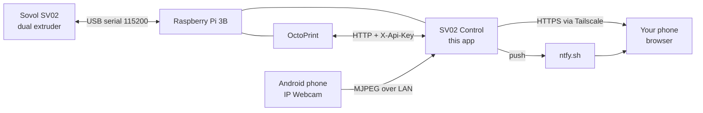

<title>SovolSmart Documentation</title>

# SovolSmart — Documentation

Everything about turning a **Sovol SV02** into a printer you can watch and
control from your phone, from anywhere.

This folder is the project's written record: what we are building, why, how
each piece works, the exact steps to build it, and what to do when something
breaks. It is written to be read in order the first time and used as a
reference afterwards.

---

## Read these in order

| # | Document | Read it when |
|---|---|---|
| 01 | [Project overview](01-project-overview.md) | First. What we are building and why, the four moving parts, the vocabulary. |
| 02 | [Roadmap](02-roadmap.md) | Second. The phases, what is done, what is next, and the gates between them. |
| 03 | [Pi & OctoPrint runbook](03-pi-and-octoprint-runbook.md) | When the SD card has finished writing. The step-by-step build. |
| 04 | [Application architecture](04-application-architecture.md) | When you want to understand or change the dashboard code. |
| 05 | [Operations & troubleshooting](05-operations-and-troubleshooting.md) | Once it is running. Daily use, and when something breaks. |
| 06 | [Firmware & hardware](06-firmware-and-hardware.md) | Before touching printer firmware, or when fitting a BLTouch. |
| 07 | [Decision log & future work](07-decision-log-and-future-work.md) | When you wonder "why was it built that way?" or "what's next?" |

Two research documents already existed in the app folder and are still the
authority on their subjects:

- [First-time setup](../sv02-control/docs/first-time-setup.md) — the original
  long-form setup guide the runbook is built from.
- [Nozzle-probe research](../sv02-control/docs/nozzle-probe-research.md) —
  auto bed levelling, and whether the SV02 can use its nozzle as a probe.

---

## The one-paragraph version

A Raspberry Pi sits next to the printer, wired to it over USB. **OctoPrint**
runs on that Pi and is the only thing that talks to the printer. A second
program — **SV02 Control**, the app in [`sv02-control/`](../sv02-control/) —
runs on the same Pi, talks to OctoPrint over HTTP, and serves one mobile-first
web page with the camera, both nozzle temperatures, the bed, progress, and the
buttons that matter. An old Android phone running **IP Webcam** is the camera.
**Tailscale** makes the whole thing reachable from outside the house without
opening a single port on the router. **ntfy** pushes a notification to your
phone when a print starts, finishes, fails, or a temperature goes wrong.

---

## Conventions used throughout

- **Placeholders** look like `<your-pi-ip>` or `<PASTE-API-KEY-HERE>`. No real
  IP address, password, or API key appears anywhere in this repository.
- **Commands on the Pi** are shown as plain `bash`. **Commands on the Windows
  laptop** are labelled as such, because they differ.
- A **gate** is a step you must not proceed past until it passes. Gates are
  called out explicitly. Skipping one always costs more time than it saves.
- Anything marked **⚠️** can damage hardware or lose data if done carelessly.
