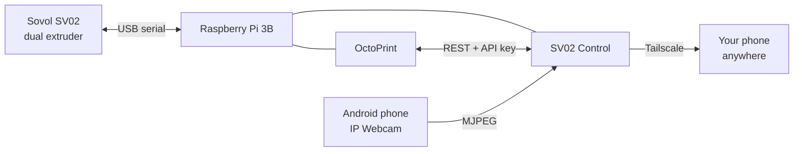

# SovolSmart

Turning a **Sovol SV02** into a printer you can watch and control from your
phone, from anywhere.

A Raspberry Pi sits next to the printer running OctoPrint. A small Node.js app
sits in front of OctoPrint and serves one mobile-first page: the camera, both
nozzle temperatures and the bed, progress, and the buttons that matter. An old
Android phone is the camera. Tailscale makes it reachable from outside the
house without opening a port. ntfy pushes an alert to your phone when a print
starts, finishes, fails — or when a temperature drifts somewhere it should not.



---

## Start here

| If you want to… | Read |
|---|---|
| Understand what this is | [Documents/01 — Project overview](Documents/01-project-overview.md) |
| Know what happens next | [Documents/02 — Roadmap](Documents/02-roadmap.md) |
| **Build it** | [Documents/03 — Pi & OctoPrint runbook](Documents/03-pi-and-octoprint-runbook.md) |
| Understand or change the code | [Documents/04 — Application architecture](Documents/04-application-architecture.md) |
| Fix something that broke | [Documents/05 — Operations & troubleshooting](Documents/05-operations-and-troubleshooting.md) |
| Touch printer firmware | [Documents/06 — Firmware & hardware](Documents/06-firmware-and-hardware.md) |
| Know why it was built this way | [Documents/07 — Decision log & future work](Documents/07-decision-log-and-future-work.md) |
| See what really happened on the hardware | [Documents/08 — Deployment log](Documents/08-deployment-log.md) |

Full documentation index: **[Documents/](Documents/README.md)**

## Try it right now, with no hardware

The whole dashboard runs against a simulated dual-extruder printer and a
simulated camera. Nothing is connected; nothing can be damaged. It is the real
app, not a mock-up.

Requires [Node.js 18+](https://nodejs.org).

```bash
cd sv02-control
npm install
```

Create `sv02-control/.env`:

```
OCTOPRINT_URL=http://localhost:5099
OCTOPRINT_API_KEY=demo-key
APP_PASSWORD=printer123
PHONE_CAMERA_URL=http://localhost:5098
SESSION_SECRET=demo-secret-abcdef0123456789abcdef01
TRUST_PROXY_HTTPS=false
```

Then, in three terminals (or backgrounded):

```bash
node test/mocks/octoprint.mjs   # fake printer on :5099
node test/mocks/camera.mjs      # fake camera on :5098
npm start                       # the real app on :8088
```

Open **http://localhost:8088** and log in with `printer123`.

The demo build (`node demo/build.mjs`) adds a *Simulate a thermal fault*
button, which is the only way to see the failure detection without an actual
fault.

## Repository layout

```
SovolSmart/
├── README.md                  you are here
├── Documents/                 the project's written record
│   ├── README.md              documentation index
│   ├── 01-project-overview.md
│   ├── 02-roadmap.md
│   ├── 03-pi-and-octoprint-runbook.md
│   ├── 04-application-architecture.md
│   ├── 05-operations-and-troubleshooting.md
│   ├── 06-firmware-and-hardware.md
│   ├── 07-decision-log-and-future-work.md
│   └── 08-deployment-log.md
├── sv02-control/              the application — self-contained, deployable
│   ├── START-HERE.md          the app's own quick start
│   ├── SETUP-PROMPT.md        the prompt for driving setup with Claude Code
│   ├── README.md              full app documentation + config reference
│   ├── server/                backend: Express, OctoPrint client, poll loop
│   ├── public/                frontend: plain HTML/CSS/JS, no build step
│   ├── test/                  62 end-to-end tests + mock printer and camera
│   ├── scripts/check.mjs      `npm run check` — the connection diagnostic
│   ├── demo/                  builds a static, hostable demo
│   ├── deploy/                systemd unit file
│   └── docs/                  first-time setup, nozzle-probe research
└── reference/                 source material, not part of the build
    ├── sv02-firmware-installation-guide.pdf
    ├── sovol-sv02-firmware-flashing-olaf-teiser.pdf
    └── firsttimesetup-superseded.md
```

## Status

The application is **finished, tested and deployed** — 62 end-to-end tests, all passing,
covering authentication, multi-heater and shared-nozzle sensor handling, pause/resume/cancel,
`M112`, the G-code allowlist, jog/extrude/fan/speed/flow/babystep bounds and
their mid-print safety rules, upload rejection paths, the camera relay,
temperature-anomaly detection and recovery, and OctoPrint dropping out
mid-print.

It is **running on real hardware** — a Pi 3B next to a Sovol SV02, reachable
over Tailscale and a Cloudflare tunnel. Progress is tracked in
[the roadmap](Documents/02-roadmap.md); what actually happened during the build,
including five problems the documentation had wrong, is in
[the deployment log](Documents/08-deployment-log.md).

## Safety

⚠️ This app watches temperatures. **It is not a fire safety device.** It reads
what the printer's own firmware reports, so it cannot detect a thermal runaway
the firmware itself misses, and it can do nothing at all if the WiFi is down.

Remote monitoring makes it tempting to leave prints running while you are out.
**Keep a working smoke alarm in the room with the printer.**

## Licence

MIT — see [`sv02-control/`](sv02-control/README.md#licence).
